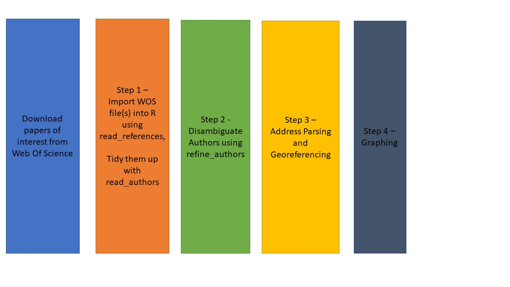
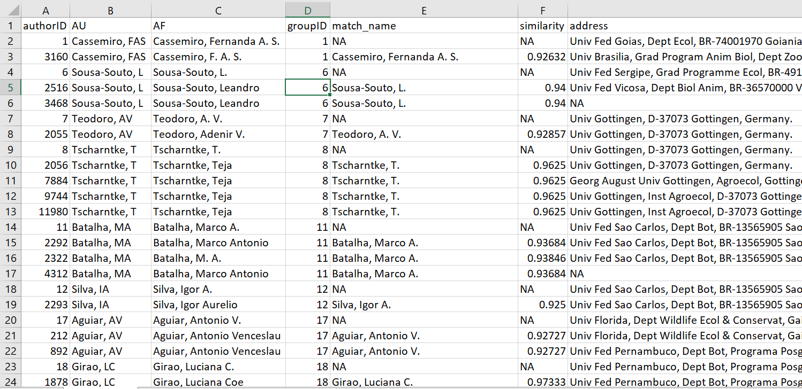
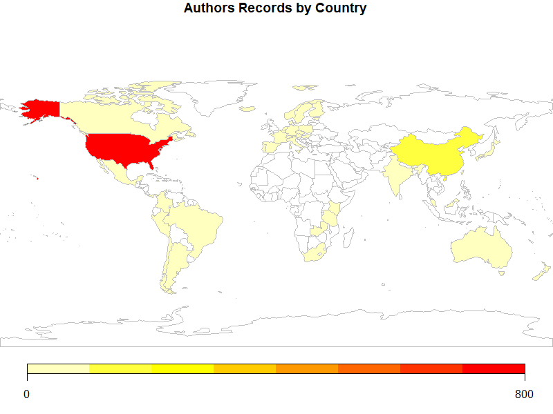
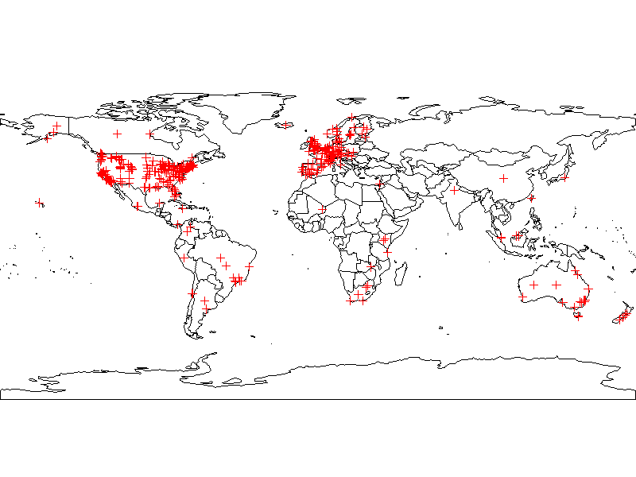
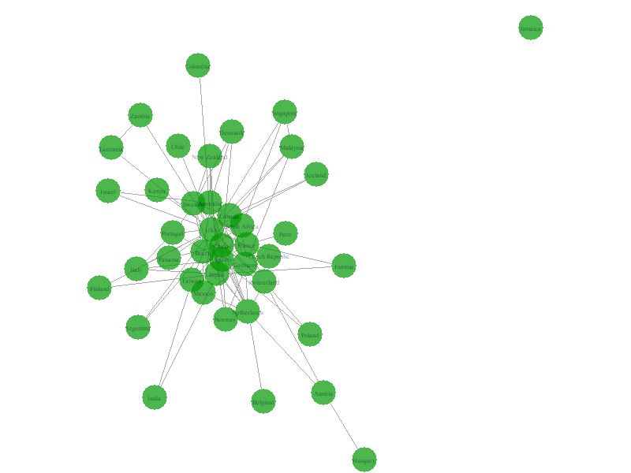

```{r setup, include = FALSE}
knitr::opts_chunk$set(
  collapse = TRUE,
  comment = "#>"
)
```

##1 Introduction

The generation and dissemination of knowledge has recently become its own subject of research, as digital data on academic outputs are more available, we have an unprecedented oppurtunity to understand how scientists do their work, who they work with, and what kinds of questions they ask (The Science of Science, Fortunato et al. 2018). One central tool in this field is the analysis of bibliometric data. **Define, their history, typical analyses and what they tell us.** In recent decades, the increased availibility of data from large bibliometric databases, such as SCOPUS and the WOS, coupled with increases in computational power, has made it possible to conduct analyses on datasets of unprecedented sizes. Researchers using data from bibliometric databases such as Sci2 Team (2009) face three major challenges. 

- 1 - Name disambiguation. It can sometimes be difficult to identify individual researchers when conducting bibliometric research, especially when using large datasets. For instance, one journals style might be for authors to use their complete first name, while another's might be to use only the initials. This could lead one to conclude that the same person is multiple researchers (e.g., Emilio M. Bruna, EM Bruna) or that different researchers are the same person (e.g., E Bruna is both Enrique Bruna and Emilio Bruna). Finally, it is possible for different researchers can also have the same name; for instance, it has been estimated that up to XX% of the authors from ===== share the name -==== (CITATION). Failing to eliminate the ambiguity surrounding individual identity can result in a mnumber of errors, such as underestimating the total number of authors, assigning authors to the wrong institution or country, or erroneously assigning the productivity of one author to another one. Although unique author identifiers (e.g., ORCID ID numbers) can eliminate this problem, to date less than 20% of authors have unique identifiers. This often means authors must manually "disambiguate" names to ensure they are correctly assigning article authorship - an extremely laborious and time-intensive task that is practically impossible for very large datasets. 

- 2 - Assigning institutional affiliation. The way in which author addresses are reported by databases makes it difficult to carry out analyses based on author institutional affiliation. Not only in there high variability among journals and authors in how addresses are reported (e.g., Dept. of Biology vs. Department of Biology vs. Departamento de Biologia; UC Davis vs. University of California-Davis), but author affiliations can be complex and idiosyncratic -- even within the same institution authors may be based at a Center, Institute, College, Department, Programs, etc. Finally, all of this highly variable information is pooled in the reference record, making it impossible to easily identify and extract the insitutional affiliation of an article's authors.  

- 3 - Extracting data for spatially explicit analyses. The way in which author addresses are reported also makes it challenging to conduct any spatially explicit analyses: not all journals report an author's city, state, country, or postal code, or they may report them in different formats (USA vs. United Statess of America, FL vs Florida). Furthermore, the same institution can have researchers working in different - often geographically disparate locations. 

`refnet` is an R package designed to help users address these major three challenges. Users can import and organize the output from [Web of Science (WOS)](https://login.webofknowledge.com/error/Error?PathInfo=%2F&Error=IPError) and [SCOPUS](https://www.scopus.com/home.uri) searchers,  disambiguate author names, calculate some basic summary statistics of the resulting dataset, and map author locations and coauthorships.  Finally, authors can export the data in tidy formats for more in-dpeth analyses with their own code or with packages such as 'revtools' (Westgate 2018a,b) or 'bibliometrix' (Aria & Cuccurullo 2017). 

## Using RefNet

Refnet's tools are applied in a three step process (Fig 1). The first step is data import and tidying, the second is author name disambiguation, and the third is georeferencing of author institutions. Some users will only require Steps 1 and 2, while for others will require all three. Refnet can also visualize the geographic distributions of authors and coauthorship networks and calculate some summary bibliometric statistics.       

 
**Figure 1 - The Steps of _refnet_**

###Step 1 - Importing Search Results 

The `refnet` package can import raw a Web of Science data file, or a directory of Web of science files. The acceptable file formats are '.txt' and '.ciw'. For this step we will use the `read_references()` function which has three arguments:  

- **data**: The directory location of the web of science files. If left blank it assumes the files are in the working directory. If it's in a separate directory, the absolute file name or relative file paths can be used.  
- **dir**: This is a true false whether you're loading from a directory (multiple web of science files in one folder, or a single file)
- **filename_root**: This specifies the output and the prefix of the output reference file. If you do not want to write a file leave this field blank. To save to a location with a prefix write the folder path followed by a '/' and then the prefix. For example:  

`"./newpath/newprefix".`  

Will save the file under the root directory + "/newpath/newprefix_references.csv"


An example of loading from a directory:  

`read_references(data = './data', dir = T, filename_root = './output/WOS')`

And loading from a single file:

`read_references(data = './data/Brazil.txt', dir = F, filename_root = './output/Brazil')`

The output of this file is a cleaned and combined file with all relevant fields merged. This is used as a base file for later analysis:

 

###Step 2 - Author Disambiguation

####Refnet Disambiguation Algorithm
The next step in the process is to use the newly made reference sheet to identify authors names and identify what authors are the same person. This can be difficult because different journals publish names in different formats. Sometimes with First names, sometimes only initials, sometimes with middle names, sometimes with no middle initial. It is because of this the function attempts to match names that are similar. However, these matches need to be hand checked for accuracy.

For this we'll use the `read_authors()` function. It takes the reference sheet we created and outputs a file of matched authors, and a master list. It has two arguments:  

- **references**: This is an object created from read_references. You can load in a previous reference sheet as long as it's an output from read_references and is saved to an object  
- **filename_root**: This is used to specify the location and prefix of the two objects. It works the exact same way as read_references. 


####Manual verification and correction of author names

Now that the algorithm has attempted to match similar names the user needs to hand check the matches. Open up the 'authors' output from the previous function. There are two important pieces of information in these files:  

- **AuthorID/GroupID**: There are two ID fields, AuthorID and GroupID. AuthorID is the unique identifier for each entry. GroupID is the ID that identifies what records are the same person.  

- **Match name**: This is the matching name the algorithm identified as part of the same author group.   

- **Similarity**: This is the similarity score calculated on likely matches. This is calculated using jaro-winkler similarity analysis. This is not performed on exact name matches or matches that did not have similar last name, first, middle combinations. This is a score from 1-100. 100 being an exact match.  

The algorithm attempts to match similar authors and then assigns similar authors to the same groupID. It then saves all match names into a file appended with '_authors.csv'. This file is the one you want to hand check matches, because it does it this iteratively the **groupID will always be the smallest authorID** of the group.

 

The sheet is ordered by groupID and then authorID. Go through each match and check that the matches make sense. You can use the similarity score, physical address, and email address to help assess whether names are the same or not. If in doubt, prior knowledge or Google should be helpful. If you find authors that are **NOT** the same person but assigned the same groupID, simply change each records **groupID** to its **authorID** to make them independent groups. 

Conversely, if you find authors that should be grouped (difficult to find), then you change each records **GroupID** to the same **GroupID** so that all records match. In this case it is good practice to make the groupID the smallest authorID of the cohort. 

When you're done, save this .csv file, load it back into R and we'll merge the change records in the next step.

####Uploading and merging corrections   

After making final assignments of similar authors, we want to merge the changes together for use in the final analysis. For this we'll use the `refine_authors()` function. It has four arguments:  
 
- **authors**: This is the new fixed authors object we saved previously. Must be in an object  
- **master**: This should be the unedited master file that was created from read_authors(). Must be in an object   
- **sim_score**: If you would like to set a threshold for the similarity score, where all scores below a threshold are assigned novel groupIDs, set the cut off here. By default this is turned off.  
- **filename_root**: The location and prefix of the output, works the same as the other functions.  

###Step 3 Identifying and georeferencing author institutions 

Now that we've identified matching authors we will calculate the authors location including their latitudes and longitudes for later mapping. We will use the `address_lat_long()` function. It has 2 arguments:  

- data: This is the output created from refine_authors. Must be an object.  
- address_column: This is a quoted character identifying what the column name that the addresses are stored in.  

The output is a modified data.frame with new columns for the latitude and longitude as well as various pieces of the address the algorithm could correctly parse out.  

> **warning** in the current version has trouble differentiating between separte campuses with similar names (e.g. University of Florida Main Campus, vs University of Florida Sattellite Campus). Depending on the resolution of your analysis this may be problematic, and we are working to address it **warning**

To create an output of the entries that `refnet2` was unable to georeference set the **write_out_missing** argument to **TRUE**. Then the user can fill in any they are able to determine and the newly populated address entries can be brought back into R. 

```
addresses <- address_lat_long(data)

new_address <- read.csv("missing_addresses.csv", 
                          stringsAsFactors = FALSE)

masteraddresses <- rbind(addresses$not_missing_addresses,
                          new_address)
```

> **warning** This function parses out addresses from the web of science reference sheet and then attempts to calculate the latitude and longitude using the datascience toolkit or Google maps API. This means it needs to use the internet and may take a rather long time to process depending on the amount of addresses it has to calculate. **warning**  

###Step 4 - Data Visualization

Now that we've successfully imported, cleaned, disambiguated and georeferenced the data. We can begin plotting the data. There five kinds of plots you can make. They are in two categories **World plots** and **Net Plots**. World plots simply plot author locations on a world map. Net plots use network analysis to plot connections of co-authorship on papers. We'll go from simple to complex. It's important to note that the rendering of these plots may take time, particularly if the amount of individual authors is >1000, depending on your computers processing power. So give it time if you are using an older computer or attempting to map a large number of points

####World Plots (by country)
To make a colored plot of all authors country of residency we'll use the `plot_addresses_country()`. The function has one argument:  

- **data**: This is the output from addresses_lat_long. Must be an object.

 

####World Plots (points)
To individual plot points of each authors location we'll use the `plot_addresses_points()`. The function has one argument:  

- **data**: This is the output from `addresses_lat_long()`. Must be an object.

 

####Net Plots (base)
To plot a network diagram of co-author countries of origins and how they're connected we'll use the `net_plot_coauthor()` function. The function has one argument:  

- **data**: This is the output from `addresses_lat_long()`. Must be an object.

This function has two outputs, in the form of a list. $plot is the plot, $data is the dataframe that was used to the build the plot. listname$plot is not very customizable, which is why $data is provided, so the user can build their own plot to their specific needs. 

 


####Net Plots (Country)
To plot a network diagram of co-author countries of origins overlayed on a world map we'll use **net_plot_coauthor_country()** function. The function has one argument:  

- **data**: This is the output from `addresses_lat_long()`. Must be an object.  

The net plot analysis returns an object that allows the plotting of these complex connections. `$plot` will plot the output to your plotting console. `$data` is the dataframe that was used to the build the plot. `$plot` is not very customizable, which is why `$data` is provided, so the user can build their own plot to their specific needs. 

 


####Net Plots (Addresses)
To plot a network diagram of co-author using their individual addresses overlayed on a world map we'll use `net_plot_coauthor_addresses()` function. The function has one argument:  

- **data**: This is the output from addresses_lat_long. Must be an object.

The net plot analysis returns an object that allows the plotting of these complex connections. `$plot` will plot the output to your plotting console.  `$data` is the dataframe that was used to the build the plot. `$plot` is not very customizable, which is why $data is provided, so the user can build their own plot to their specific needs. 

This function can create a large data set (100's of MB), and may takes several minutes, so be patient and take the size of resources into account when running.  

 


##Summary


##Acknowledgments

Support for the development of RefNet was provided by grants from the University of Florida's Center for Latin American Studies and Informatics Institute.

##References

Aria, M. & Cuccurullo, C. (2017) bibliometrix: An R-tool for comprehensive science mapping analysis, Journal of Informetrics,  11(4), pp 959-975, Elsevier.

Fortunato, S., C. T. Bergstrom, K. B?rner, J. A. Evans, D. Helbing, S. Milojevic, A. M. Petersen, F. Radicchi, R. Sinatra, B. Uzzi, A. Vespignani, L. Waltman, D. Wang, & A.-L. Barab?si. 2018. Science of science 359:eaao0185.

Sci2 Team. (2009). Science of Science (Sci2) Tool. Indiana University and SciTech Strategies, https://sci2.cns.iu.edu. 

Westgate, M. J. (2018a). revtools: Tools to Support Evidence Synthesis. R package version 0.2.2.
  https://CRAN.R-project.org/package=revtools
  
Westgate, M. J. (2018b). revtools: bibliographic data visualization for evidence synthesis in R. bioRxiv:262881. doi: 10.1101/262881
