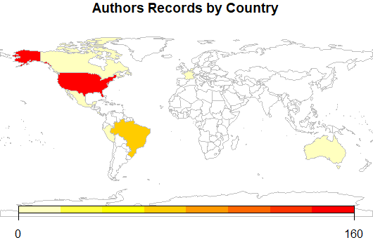
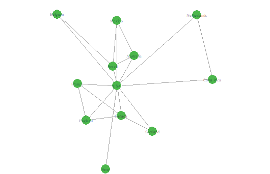
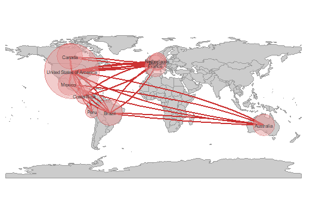
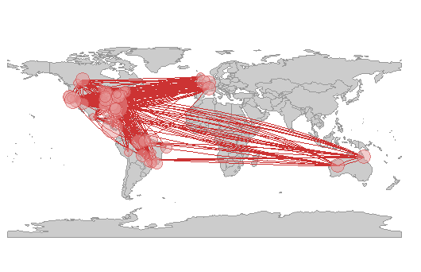

```{r setup, include = FALSE}
knitr::opts_chunk$set(
  collapse = TRUE,
  comment = "#>"
)
```

##1. Introduction

The Science of Science (SciSci) is an emerging, trans-disciplinary approach for using large and disparate data-sets to study the emergence, dissemination, and impact of scientific research (Fortunato et al. 2018). Bibliometric databases such as the [Web of Science](https://login.webofknowledge.com/error/Error?PathInfo=%2F&Error=IPError) and [SCOPUS](https://www.scopus.com/home.uri) are rich sources of data for SciSci studies (Sugimoto and Lariviare 2018). In recent years the type and scope of questions addressed with data gathered from these databases has expanded tremendously (Forutnato et al. 2018). This is due in part to their expanding coverage and greater accessibility, but also because advances in computational power make it possible to analyze data-sets comprising millions of bibliographic records (e.g., Lariviare et al. 2013, Smith et al. 2014). 

The rapidly increasing size of bibliometric data-sets available to researchers has exascerbated two major and persistent challenges in SciSci research. The first of these is **Author Name Disambiguation**. Correctly identifying the authors of a research product is fundamental to bibliometric research, as is the ability to correctly attribute to a given author all of their scholarly output. However, this seemingly straightforward task can often be extremely complicated, even when using the nominally high-quality data extracted from bibliometric databases (reviewed in Smalheiser and Torvik 2009). The most obvious case is when different authors have identical names, which can be quite common in some countries (Strotmann et al. 2009). However, confusion might also arise as a result of journal conventions or individual preferences for abbreviating names. For instance, one might conclude "J. C. Smith", "Jennifer C. Smith", and "J. Smith" are different authors, when in fact they are the same person. In contrast, papers by "E. Martinez" could have been written by different authors with the same last name but whose first names start with the same letter (e.g., "Enrique", "Eduardo"). Failure to disambiguate author names can seriously undermine the conclusions of some SciSci studies, but manually verifying author identity quickly becomes impractical as the number of authors or papers in a dataset increases. 

The second challenge to working with large bibliometric data-sets is correctly **parsing author addresses**. The structure of author affiliations is complex and idiosyncratic, and journals differ in the information they require authors to provide and the way in which they present it. Authors may also represent affiliations in different ways on different articles. For instance, the affiliations might be written in different ways in different journals (e.g., "Dept. of Biology", "Department of Biology", "Departamento de Biologia"). The same is true of the institution's name ("UC Davis", "University of California-Davis","University of California") or the country in which it is based ("USA", "United States", "United States of America"). Researchers at academic institutions might include the one or more Centers, Institutes, Colleges, Departments, or Programs in their address, and researchers working for the same institution could be based at units in geographically disparate locations (e.g., a [University of Florida researcher could be based at one of 12 statewide Research and Education Centers, five research laboratories, 67 county extension offices, or the main campus in Gainesville](https://research.ifas.ufl.edu/main-menu-tab/about-us/research-facilities/)). Finally, affiliations are recorded in a single field of a reference's bibliographic record, despite comprising very different types of information (e.g., city, postal code, institution). In concert, these factors can make it challenging to conduct analyses for which author affiliation or location is of particular interest.     

Package [**`refnet`**](https://CRAN.R-project.org/package=XXXXX) helps users of the R statistical computing environment (R Core Team 2017) address these challenges. It imports and organizes the output from Web of Science and SCOPUS searches, disambiguates author names and suggests which might need additional scrutiny, parses author addresses, and georeferences authors' institutions (Fig 1). It also generates simple summary bibliometric statistics and maps author locations and coauthorships. Finally, the processed data-sets can be exported in tidy formats for more in-depth analyses with user-written code or imported into packages such as [**`revtools`**](https://cran.r-project.org/web/packages/revtools/index.html) (Westgate 2018) or [**`bibliometrix`**](https://cran.r-project.org/web/packages/bibliometrix/index.html) (Aria & Cuccurullo 2017).


##2. Using refnet

Appendix 1 provides guidance on downloading records from the Web of Science in the proper format for use in `refnet`.  Once bibliographic records have been downloaded, the `refnet` package's tools are applied in four steps:   

1. importing and tidying reference records (Section 2.1)
2. author name disambiguation and parsing of author addresses (Section 2.2)
3. georeferencing of author institutions (Section 2.3)
4. data visualization (Section 2.4)

```{r, echo=FALSE, fig.pos="H"}
knitr::include_graphics("images/refnet_fig1.jpg")
```

These examples below use the sample dataset 'Brazil.txt' included with the refnet package. *The examples assume one has created two folders in ones working directory or Rstudio Project Folder: one named 'data' and one names 'output' - and that the exported bibliographic records are saved in the 'data' folder*.    


###2.1. Importing Search Results 

The `refnet` package can either import a single Web of Science/SCOPUS search result file or combine and import multiple files located in the same directory. The acceptable file formats are '.txt' and '.ciw'. Importing reference records is done with the `references_read()` function, which has three arguments:  

- **data**: The location of the directory in which the Web of Science file(s) are located. If left blank it assumes the files are in the working directory. If in a different directory (e.g., the 'data' folder in the working directory), the absolute file name or relative file paths can be used.  

- **dir**: TRUE when loading multiple files; FALSE when loading a single file. When multiple files are processed `refnet` identifies and removes any duplicate reference records.

- **filename_root**: The location in which the output file is to be saved (e.g., the 'output' folder in the working directory) and the prefix used to name it. If you do not want to write a file leave this field blank. 

The output of `references_read()` is an object in the R Workspace and a .csv file. Each line of the output is a reference; the columns are the name of the .txt file from which the data were extracted, a unique id number assigned by `refnet` to each article, and the data from each field of the reference record (identified by the [Web of Science](https://images.webofknowledge.com/images/help/WOS/hs_wos_fieldtags.html) or [SCOPUS](https://service.elsevier.com/app/answers/detail/a_id/11236/supporthub/scopus/#) codes for different data types (Appendix 2). This file is used by `refnet` for Step 2.


####Example

a. To import and process a single file located in a folder named "data" and save the output as a file named "Brazil_references" in the "output" folder: 

> `Brazil_references <- references_read(data = './data/Brazil.txt', dir = F, filename_root = './output/Brazil')`

b. To import and process multiple files located in a folder named "data" and save the output as "WOS_references" in the "output" folder: 

> `WOS_references <- references_read(data = './data', dir = T, filename_root = './output/WOS')`

c. To save to a location with a prefix, write the folder path followed by a '/' and then the prefix. This will save the file under the root directory as "/newpath/newprefix_references.csv": 

> `"./newpath/newprefix".`


<!-- Figure showing output of references_read() -->
<!-- ```{r, echo=FALSE, fig.pos="H"} -->
<!-- knitr::include_graphics("images/-----.jpg") -->
<!-- ``` -->

###2.2. Author address parsing and name disambiguation 

The next step is to identify all unique authors in the dataset and parse their affiliations for each of their articles. This requires identifying any authors whose name appears to be represented in different ways on different publications. Name disambiguation is a complex statistical and computational problem for which researchers have used data ranging from author affiliation to patterns of coauthorship and citation (reviewed in Smalheiser & Torvik 2009). The `authors_clean()` disambiguation algorithm, described in greater detail in Appendix 3, first assigns each author of each article a unique ID number, then assigns putative name variants representing the same author a group ID number. The function `authors_clean()` has two arguments:  

- **references**: The object created by `references_read()`, from which author names will be extracted. Any previously generated output from `references_read()` that has been saved to an object can be used.

- **filename_root**:  The location in which the output file is to be saved and the prefix used to name it. If you do not want to write a file leave this field blank. The syntax is the same as for `references_read()`. 

The output of `authors_clean()` is a list in the R workspace with two elements: (1) "prelim", which is the initial list of disambiguated author names, and (2) "review", which is the subset of authors with putative name variants suggested for verification. Each of these elements is also saved as a separate .csv file in the location specified in the function (e.g., the output folder in the working directory).  

Once disambiguation is complete, users can accept `refnet`'s results without reviewing names flagged for manual inspection (Section 2.2.1). Alternatively, users can review the subset of names recommended for inspection and make corrections if needed (Section 2.2.2). These corrections are then used to generate the 'refined' dataset used for analyses (Section 2.2.3). 

####Example

a. To disambiguate the authors of the references in the dataset and place the "preliminary" and "review" author lists in the "output" folder: 

> `Brazil_authors <- authors_clean(Brazil_references, filename_root="./output/Brazil")`


<!-- Figure showing output of authors_clean() -->
<!-- ```{r, echo=FALSE, fig.pos="H"} -->
<!-- knitr::include_graphics("images/-----.jpg") -->
<!-- ``` -->


####2.2.1. Accepting the results of author disambiguation *without* manual review

Accepting the result of `refnet`'s disambiguation algorithm without inspecting names flagged for review is done with the `authors_refine()` function. It has four arguments:  
 
- **review**: The names proposed for manual review by `authors_clean()`. Must be in an object.  
- **prelim**: The preliminary file of disambiguated author names created with `authors_clean()`. Must be an object   
- **sim_score**: The threshold for the similarity score below which authors are assigned different groupIDs (range: 0-1; 1 = names must be identical to be assigned to the same group). By default this is turned off.
- **filename_root**: The prefix for the resulting output and locations to which it will be saved, using the same syntax as for previous functions. 

The output of `authors_refine()` is an object in the R Workspace and a .csv file.    

####Example

a. To accept the results of author disambiguation without manual review: 

> `Brazil_authors_refined <- authors_refine(Brazil_review, Brazil_authors_prelim, filename_root="./output/Brazil")`


####2.2.2. Reviewing and correcting the results of disambiguation

Users that prefer to manually review the results of the disambiguation can do so with the "authors" object and .csv files. A more thorough overview of the information provided in these files and how to use it to review and correct author name assignments is provided in Appendix 2).

- **If different authors were incorrectly assigned the same groupID number:** replace the number in the **groupID** column of the unique author with the value from that person's **authorID** column. *Be sure to use the authorID value from the same row.* 

- **If the same author was incorrectly assigned different groupID numbers:** replace the number in the **groupID** column of the name variants to be pooled with a single **AuthorID** number. *We recommend using the lowest authorID number of the name variants being pooled*.

####Example

Image of the reivew file:

Same image indicating author grouped incorrectly 

Same image name not grouped that should have been

Image showing final refined with corrections and instructions to same as "----_authors_corrected.csv" in the output folder


####2.2.3. Uploading and merging the results of disambiguation

Corrections made to the "review" file are merged into the "preview" file using the `authors_refine()` function. It has four arguments:  
 
- **corrected**: The corrected version of the "review" object. Must be in an object. So read in corrected .csv file first.
- **prelim**: The preliminary list of disambiguated author names created with `authors_clean()`. Must be in an object.
- **sim_score**: The threshold for the similarity score below which authors are assigned different groupIDs (range: 0-1; 1 = names must be identical to be assigned to the same group). By default this is turned off.
- **filename_root**: The prefix for the resulting output and locations to which it will be saved, using the same syntax as for previous functions. 

The output of `authors_refine()` is a file is an object in the R Workspace and a .csv file. 

####Example

> `Brazil_authors_refined <- authors_refine(Brazil_authors_corrected, Brazil_authors_prelim, filename_root="./output/Brazil")`


```{r, echo=FALSE, fig.pos="H"}
knitr::include_graphics("images/AuthorMatch.PNG")
``` 
  
  
###2.3. Georeferencing author institutions 

Users can georeference author's institutions (latitude & longitude) using the `authors_georef()` function. This function has has 2 arguments:  

- **data**: The output created by `authors_refine()`. Must be an object.
- **address_column**: A quoted character identifying the column name in which addresses are stored.
- **write_out_missing**: if TRUE creates a file with the author addresses that that `refnet` was unable to georeference; set to FALSE by default

The outputs of `authors_georef()` are (1) a modified data.frame with new columns for the latitude and longitude of each authors institution and the parts of the author's address that could be parsed out from the WOS record, and (2) an output/file of references that refnet was unable to georeference, which the user can review, manually correct, and import back into the file of georeferenced author locations. Output is saved as `filename_addresses.csv`. 

- **Warning #1**: it can be difficult for this version of `refnet` (v1.0) to differentiate between geographically distinct installations of the same institution (e.g. Mississippi State University Main Campus in Starkville, MS vs Mississippi State University Coastal Research and Extension in Biloxi, MS (250 miles apart)). 

- **warning #2** The `authors_georef()`function parses addresses from the Web of Science reference sheet and then attempts to calculate the latitude and longitude for them with the [http://www.datasciencetoolkit.org/](Datascience Toolkit) or [https://developers.google.com/maps/documentation/](Google Maps API). The time required to do so depends on the number of addresses being processed and the speed of the internet connection. 


####Example

> `Brazil_georef <-authors_georef(------,------,-----)`


###2.4. Data Visualization: Productivity and Collaboration 

`refnet` can generate five visualizations of productivity and collaboration. **World plots** indicate the locations of authors on a map of the world, while **Net plots** are visualizations of co-authorship networks. `plot_addresses_country()` uses the `rworldmap` package, `plot_addresses_points()`, `plot_net_address()`, and `plot_net_country()` use the `ggplot2` package, and `plot_net_coauthor()` uses package `igraph`. Advanced users familiar with these packages can customize the visualizations to suit their needs.  **Warning**: The time required to render these plots is highly dependent on the number of authors in the dataset and the processing power of the computer on which analyses are being carried out. 

####2.4.1. World Plot 1: Authors By Country.

The `plot_addresses_country()` makes a plot whose shading indicates the number of papers with an author based in a given country. There is no fractional authorship, e.g., if an author based in the USA has authored or coauthored 3 papers in the dataset, then the USA will be credited with 3 articles 

The function has one argument:  

- **data**: This is the output from `authors_georef()`

The output of `plot_addresses_country()` is plot from the `rworldmap` package. 

####Example

> `plot_addresses_country <- plot_addresses_country(data, filename_root="./output/Brazil")`

```{r, echo=FALSE, fig.pos="H"}

``` 

####2.4.2. World Plots (points)

The `plot_addresses_points()` function plots the location of all authors in the dataset. 

The function has one argument:  

- **data**: This is the output from `authors_georef()`. Must be an object.

The output of `authors_georef()` is a ggplot object. 

####Example

> `plot_addresses_points <- plot_addresses_points(data, filename_root="./output/Brazil")`


```{r, echo=FALSE, fig.pos="H"}
knitr::include_graphics("images/plot_addresses_points.png")
``` 

####2.4.3. Net Plots (base)
The `plot_net_coauthor()` function plots a co-authorship network based on the countries in which authors are based. 

The function has one argument:  

- **data**: This is the output from `authors_georef()`. Must be an object.

This function has one output, a plot, built in `igraph`.

####Example

> `plot_addresses_points <- plot_addresses_points(data, filename_root="./output/Brazil")`

```{r, echo=FALSE, fig.pos="H"}

``` 

####2.4.4. Net Plots (Country)
The `plot_net_country()` function plots a coauthorship network of the countries in which co-authors are based that is overlayed on a world map. The circles represent the number of authors based in a country. 

The function has one argument:  

- **data**: This is the output from `authors_georef()`. Must be an object.  

The output of `plot_net_country()` is an list.  The `$plot` element contains ggplot object. Because the ability to customize `$plot` is limited, three datasets are provided so that users can generate and customize their own plots:

1. The `$data_path` element contains the data for the connecting lines. 
2. The `$data_polygon` element contains the data for the country outlines.  
3. The `$data_point` element contains the data for the circles on the map. 

####Example

> `plot_net_country <- plot_net_country(data, filename_root="./output/Brazil")`

```{r, echo=FALSE, fig.pos="H"}

``` 


####2.4.5. Net Plots (Addresses)
The `plot_net_addresses()` function is used to plot a georeferenced coauthorship network based on author institutional addresses. **Warning:** This function can create a large data set (100s of MB) and may takes several minutes to complete...be patient and take into account the system resources available when running it.  

The function has one argument:  

- **data**: This is the output from `authors_georef()`. Must be an object.

The output of `plot_net_addresses()` is an list. The `$plot` element contains ggplot object. Because the ability to customize `$plot` is limited, three datasets are provided so that users can generate and customize their own plots:

1. The `$data_path` element contains the data for the connecting lines. 
2. The `$data_polygon` element contains the data for the country outlines.  
3. The `$data_point` element contains the data for the circles on the map. 

####Example
> `plot_net_addresses <- plot_net_addresses(data, filename_root="./output/Brazil")`

```{r, echo=FALSE, fig.pos="H"}

``` 


##Acknowledgments

Support for the development of refnet was provided by grants from the University of Florida Center for Latin American Studies and the University of Florida Informatics Institute.

##References

Aria, M. & Cuccurullo, C. (2017) bibliometrix: An R-tool for comprehensive science mapping analysis. Journal of Informetrics, 11(4): 959-975.

Fortunato, S., C. T. Bergstrom, K. Barner, J. A. Evans, D. Helbing, S. Milojevic, A. M. Petersen, F. Radicchi, R. Sinatra, B. Uzzi, A. Vespignani, L. Waltman, D. Wang, & A.-L. Barabasi (2018). Science of science. Science, 359: eaao0185.

Lariviare, V., Ni, C., Gingras, Y., Cronin, B., & Sugimoto, C. R. (2013). Bibliometrics: Global gender disparities in science. Nature News, 504(7479): 211-213

R Core Team (2017). R: A Language and Environment for Statistical Computing. R Foundation for Statistical Computing, Vienna, Austria. URL https://www.R-project.org/.

Smalheiser, N. R., & Torvik, V. I. (2009). Author name disambiguation. Annual Review of Information Science and Technology, 43(1): 1-43.

Smith, M. J., Weinberger, C., Bruna, E. M., & Allesina, S. (2014). The scientific impact of nations: Journal placement and citation performance, PLOS One 9(10): e109195.

Strotmann, A. and Zhao, D., (2012). Author name disambiguation: What difference does it make in author based citation analysis?. Journal of the Association for Information Science and Technology, 63(9): 1820-1833.

Sugimoto CR, Lariviare V. (2018). Measuring Research: What Everyone Needs to Know?. Oxford University Press, Oxford, UK. 149 pp.

Westgate, M. J. (2018b). revtools: bibliographic data visualization for evidence synthesis in R. bioRxiv:262881. doi: 10.1101/262881


# **Appendix 1:** Guide to downloading reference records from the Web of Science.

```{r, echo=FALSE, fig.pos="H"}
knitr::include_graphics("images/Appendix1b.jpg")
```

## **Appendix 2:** Column headings in `refnet` output files. 

```{r echo = FALSE, results = 'asis'}
# library(knitr)
App2Table1<-read.csv("App2_Table1.csv",dec=".", header = TRUE, sep = ",", check.names=FALSE)
knitr::kable(App2Table1, caption = "Table 1. Definition of column headings in the output of read_references()^1^. Most are [Web of Science Core Collection Field Tags](https://images.webofknowledge.com/images/help/WOS/hs_wos_fieldtags.html) associated with different data types.")
```
^1^the following Web of Science data fields are only included if users select the `all.fields=T` option in `references_read()`: CC, CH, CL, CT, CY, DT, FX, GA, GE, ID, IS, J9, JI, LA, LT, MC, MI, NR, PA, PI, PN, PS, RID, SU, TA, VR.

^2^Includes sitations in the Web of Science Core Collection, BIOSIS Citation Index, Chinese Science Citation Database, Data Citation Index, Russian Science Citation Index, and SciELO Citation Index.


```{r echo = FALSE, results = 'asis'}
App2Table2<-read.csv("App2_Table2.csv",dec=".", header = TRUE, sep = ",", check.names=FALSE)

knitr::kable(App2Table2, caption = "Table 2. Information provided by the `authors_clean()` function to help users assess the validity of groupings generated by `refnet`'s disambiguation algorithm.")
```


## **Appendix 3:** Overview of the `refnet` author name disambiguation algorithm.

Name disambiguation is a complex process that is the subject of active research. There are a variety of approaches to disambiguation in large datasets; here we describe the alogorithm for parsing author adresses and disambiguating author names with the `authors_clean()` function. 

There are three primary difficulties in assigning authors to their products in bibliometric databases like the Web of Science or SCOPUS. First, not all authors have an ORCID ID or other unique identifier. Second, an author's name can vary over time. It can also be reported inconsistently accross journals. For instance, while author last names are always reported, the first names might only be represented by initials and middle names (if authors have one) might not be reported or might only be stored as a middle initial. Finally, information in the "address" field can have inconsistent structures. In addition, [only after 2008 did Web of Sceince records directly link each author with their institutional address](https://images.webofknowledge.com/images/help/WOS/hp_full_record.html#dsy1030-TRS_addresses). As a result, for pre-2008 Web of Science records it can be difficult to relate each author with their institutional address (the same is true for emaail addresses). In these cases, we have no way to reliably match addresses to authors using the information in the reference record and therefore insert 'Could not be extracted' in the address field. This does not mean an address was not listed or cannot be assigned after manual inspection - only that there was no way to discern to which author the address belongs. Coupled with changes in author addresses as they change institutions, this the inconsistent or incomplete information associated with author addresses makes disambiguating names difficult. 

To address this we've created a process to identify clusters or common authors by iteratively building webs of authors using any available information to link groups together. In this way, we don't require an entry to contain all relevant fields, but can neverthtless create likely groupings and then refine them by throwing out obvious spurious connections. In the case of authors with ORCIDS and RI IDS, identifying commonalities is quite easy, and we hope that authors will contune to sign up for these identifiers to facilitate disambiguation. 

The first step in our disambiguation process is matching all groups together with common ORCID and RI IDs. The remaining entries go through a series of logical rules to help match the author with only LIKELY entries. Throughout this analysis we assume that every author has a complete last name, and require it to contain two additional pieces of qualifying information to match it up to groups. These can include first name, middle name, address, or email. Where we understand that the first and middle name may also just be initials. Requiring this type of information means we cannot match authors that do not contain any of this extra information, and so we do not group entries with no middle name, address, AND email, but instead call them their own group and skip them from the following analysis. To lower calculation times, as the algorithm attempts to match each entry it creates a subset of possible matching combinations of last and first names, and then attempts to match them against middle initials, address, and email addresses.

- *note regarding email addresses* - Similar to street addresses, email addresses are often stored inconsistently with no direct link between author and email address. In these cases, we run a Jaro Winkler distance measurement that calculates the amount of transpositions required to turn one string (an author name) into another (an email address). This works very well when email addresses are in a standard format (e.g., "lastname"."firstname" @ university.edu). We match author names to each email and use a threshold percentage of 0.70. If no names match up below this threshold we disregard the email and leave the field blank in the author name.


Below is an example of how the algorithm processes a sample data set.
 
```{r, echo=FALSE, fig.pos="H"}
knitr::include_graphics("images/appendix3.1.png")
``` 
 
In this dataset we have 10 authors, with a mixture of incomplete columns for each row. Rows 2 and 5 were given the same groupID priori because of their matching ORCIDs. We'll walk through the remaining entries and how the algorithm matches names together.

To lower the amount of Type II errors we build a dataset of possible matchings for each author, each entry in this subset must constrict to the following guidelines:

1.	In all cases last names must match exactly (case insensitive). This means misspelling will likely not get matched unless they have an OI or RI to match against.

2.	First names must match or in the case they only have an initial then that initial must match.

3.	Middle names must match or in the case they only have an initial they must match. If no middle name exists it is allowed in given that it has another piece of identifying information (an address or email address)

**Entry 1.** In our test data we will start trying to match the first entry "Smith, J" in row 1. By subsetting with the above rules, we'd be matching the first row against rows 2, 3, 4, 5, 6, 7, 9:

```{r, echo=FALSE, fig.pos="H"}
knitr::include_graphics("images/appendix3.2.png")
``` 

Once we have our subset of possible similar entries, we match the existing info of row 1 against the subset. The entry only needs to match one extra piece of information (address, email, or middle name). If it matches we assume it's a similar person and change the groupIDs to reflect this. 

In our test data, there is only one piece of information we can match against (among middle name, address, or email), and that is address. This makes the obvious match row 5. And we change the groupID for our entry to groupID 2. This gives us three entries with the groupID of 2.

**Entry 2.**  Row 2 was already matched to another group using ORCID prior, so it is skipped.

**Entry 3.** Row 3 has 2 unique identifying pieces of information: A middle initial and an email. This subset is smaller because we have a middle initial to filter out the Smith, J.L entries: 
 
```{r, echo=FALSE, fig.pos="H"}
knitr::include_graphics("images/appendix3.3.png")
```  
 
Matching this information against our subset, the two possible matches are row 2 and 7. And in these cases we choose the lowest numbered entry as its likely to have been grouped already. However, even if entry 7 was chosen as a match, entry 7 will eventually be matched up to groupID 2. When a parent groupID is changed like this, we change all the children entries to match the new ID as well. So, the decision is partially arbitrary.

**Entry 4** - This entry gets assigned groupID 2 as well because it has a matching middle initial with row 2 and 3:

```{r, echo=FALSE, fig.pos="H"}
knitr::include_graphics("images/appendix3.4.png")
``` 

**Entry 5** - Row 5 has already been matched by ORCID so it is skipped.

**Entry 6** - Row 6 has no additional matching information, no middle name, address, or email. Because of there is no way to reliably know which Smith, J it belongs to, so the entry is assumed to be its own group and skipped.

**Entry 7** - Entry 7 has one unique identifier, an email address. It gets matched up to the entry in row 3 and therefore gets groupID 2. 

```{r, echo=FALSE, fig.pos="H"}
knitr::include_graphics("images/appendix3.5.png")
```  

After these first 7 entries, we've correctly matched all likely Smith, Jon Karl's together and created the Jon Karl Smith complex. Now we'll move onto a situation where we'll have inadequate information and are forced to run a Jaro Winkler distance analysis to decide the likely match.

**Entry 8** - This novel entry has 2 unique pieces of information: a middle initial and an ORCID. We know the ORCID did not match any previous entries prior, and the middle initial does not match up with any Smiths in our record. 
 
```{r, echo=FALSE, fig.pos="H"}
knitr::include_graphics("images/appendix3.6.png")
```  

Because we do not have any adequate matches, we match the entry by calculating a jaro winkler distance between row 8 and the author names in our subset. The following matching results were: 0.9[1], 0.9[5],0.9[6], 0.96[9]. Therefore, the most likely match is row 9. We change the groupID to 9, and set aside this entry for the user to hand check later. 

**Entry 9** - Results in the same result as 8 and is matched to entry 8 which already has the groupID of 9. 

**Entry 10** - This entry has no matching names and results in no change to the groupID number.

```{r, echo=FALSE, fig.pos="H"}
knitr::include_graphics("images/appendix3.7.png")
``` 

Thus our final results are: **[is something missing here?]**
 
As a final check against our created groupings, we attempt to prune groupings by reanalyzing if First name, last name, and middle names match. This is because matching entries using incomplete info occasionally creates novel situations where two similar names are called the same groupID if they have similar other information like same first name and the same address. Additionally, the imperfect matching of email addresses occasionally matches up relatives or significant others who publish together with the incorrect email creating a mismatched complex. This final pruning step separates the groups entirely by name. It should be noted this situation in general is rare. 

This step is not necessary in our example data as all names in each grouping were logical. In our final data set, we have therefore identified 4 likely complexes (Smith, Jon Karl; Smith, J; Smith, James; and Smith Sam). Entrys 8 and 9 were matched together and require hand checking as no novel information was used. This results in this data.frame being outputted separate from the master authors data.frame:
 
```{r, echo=FALSE, fig.pos="H"}
knitr::include_graphics("images/appendix3.8.png")
``` 


