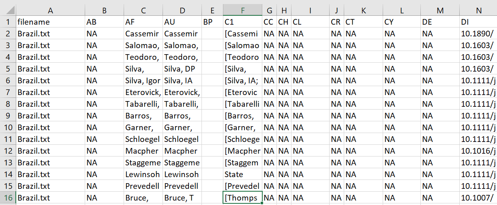
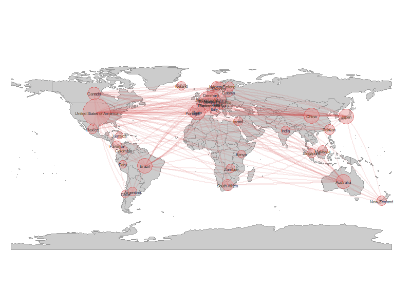
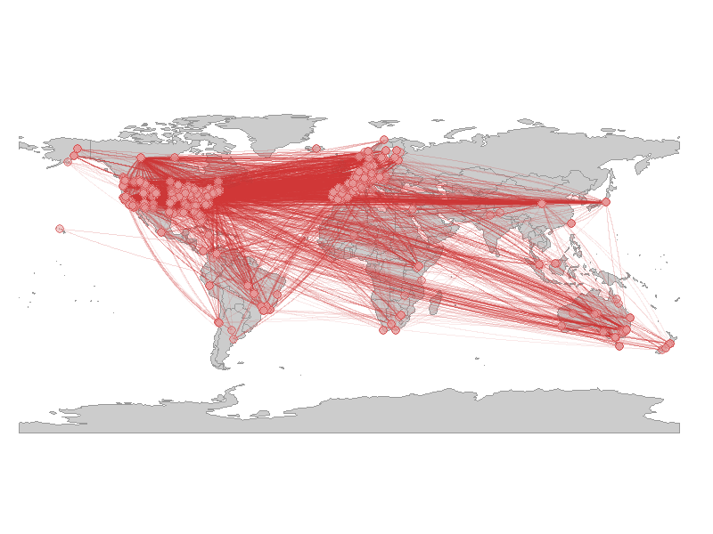

```{r setup, include = FALSE}
knitr::opts_chunk$set(
  collapse = TRUE,
  comment = "#>"
)
```

##1. Introduction

The Science of Science (SciSci) is an emerging, transdisciplinary approach for using large and disparate datasets to study the emergence, disemination, and impact of scientific research (Fortunato et al. 2018). Bibliometric databases such as the [Web of Science](https://login.webofknowledge.com/error/Error?PathInfo=%2F&Error=IPError) and [SCOPUS](https://www.scopus.com/home.uri) are rich sources of data for SciSci studies (Sugimoto and Lariviare 2018). In recent years the type and scope of questions addressed with data gathered from these databases has expanded tremendously (Forutnato et al. 2018). This is due in part to their expanding coverage and greater accessibility, but also because advances in computational power make it possible to analyze datasets comprising millions of bibliographic records (e.g., Lariviare et al. 2013, Smith et al. 2014). 

The rapidly increasing size of bibliometric datasets available to researchers has exascerbated two major and persistent challenges in SciSci research. The first of these is **Author Name Disambiguation**. Correctly identifying the authors of a research product is fundamental to bibliometric research, as is the ability to correctly attribute to a given author all of their scholarly output. However, this seemingly simple task can often be extremely complicated, even when using the nominally high-quality data extracted from bibliometric databases (reviewed in Smalheiser and Torvik 2009). The most obvious case is when different authors have identical names, which can be quite common in some countries (Strotmann et al. 2009). However, confusion might also arise as a result of journal conventions or individual preferences for abbreviating names. For instance, one might assume "J. C. Smith", "Jennifer C. Smith", and "J. Smith" are different authors when in fact they are the same person. Similarly, papers by "E. Martinez" could have been written by the same person or by two different authors whose first names start with the same letter (e.g., "Enrique", "Eduardo"). Failure to disambiguate author names can seriously undermine the conclusions of analyses, but verifying author identity manually quickly becomes impractical as the number of authors in a dataset increases. 

The second challenge to working with large bibliometric datasets is correctly **parsing author addresses**. The structure of author affiliations is complex and idiosyncratic, and journals differ in the information they require authors to provide as well as the way in which they present it. For instance, researchers at academic institutions might include the one or more Centers, Institutes, Colleges, Departments, or Programs in their address. The affiliations might be written in different ways in different journals (e.g., "Dept. of Biology", "Department of Biology", "Departamento de Biologia"); the same is true of the institution ("UC Davis", "University of California-Davis","University of California") or country in which it is based ("USA", "United States", "United States of America"). Researchers working for the same institution could be based at units in geographically disparate locations. Finally, these complex and affiliations are all recorded in a single field of a reference's bibliographic record, despite comprising very different types of information (e.g., city, postal code, institution). In concert, these factors can make it challenging to carry out analyses for which author affiliation or location is of particular interest.     

Package [**`refnet`**](https://CRAN.R-project.org/package=XXXXX) was written to help users of the R statistical computing environment (R Core Team 2017) address these challenges. It imports and organizes the output from Web of Science and SCOPUS searches, disambiguate author names and flags any needing additional scrutiny, parses author addresses, and georeferences author institutions. It also generates simple summary bibliometric statistics and maps author locations and coauthorships. Finally, the data can be exported in tidy formats for more in-depth analyses with user-written code or imported into packages such as 'revtools' (Westgate 2018a,b) or 'bibliometrix' (Aria & Cuccurullo 2017).


##2. Using RefNet

Once bibliographic records have been downloaded (for guidance see Appendix 1), `refnet`'s tools are applied in four steps:   
- (1) importing and tidying reference records,   
- (2) parsing of author addresses and author name disambiguation,  
- (3) georeferencing of author institutions, and   
- (4) data analysis and visualization (Fig 1).    

Each of these steps is described below; Appendix 2 guides users through the entire process with a sample dataset.  


<p align="center">
 
</p>
<p align="center">
**Figure 1:** _refnet_ allows users to import, organize, and visualize bibliographic data in 4 simple steps.
</p>

###2.1. Importing Search Results 

The `refnet` package can import a single Web of Science data file combine and import multiple files in the same directory. The acceptable file formats are '.txt' and '.ciw'. For this step we will use the `references_read()` function, which has three arguments:  

- **data**: The location of the directory in which the Web of Science file(s) are located. If left blank it assumes the files are in the working directory. If in a different directory, the absolute file name or relative file paths can be used.  
- **dir**: TRUE when loading multiple files; FALSE when loading a single file. When multiple files are processed `RefNet` identifies and removes any duplicate reference records.
- **filename_root**: The location in which the output file is to be saved and the prefix used to name it. If you do not want to write a file leave this field blank. 

The output of `references_read()` is a an object in the R Workspace, which is also written out into a .csv file, in which each line is a WOS record and columns are the different parts of the bibliographic record (author name, journal name, article title, etc). This file is used by `refnet` for Step 2.

 

####Example

a. To import and process a single file located in a folder named "data" and save the output as a file named "Brazil" it in a folder named "output": 

> `references_read(data = './data/Brazil.txt', 
                    dir = F, 
                    filename_root = './output/Brazil')
`

b. To import and process multiple files located in a folder named "data" and save the output as "WOS" in a folder named "output": 

> `references_read(data = './data', dir = T, filename_root = './output/WOS')`

c. To save to a location with a prefix, write the folder path followed by a '/' and then the prefix. This will save the file under the root directory as "/newpath/newprefix_references.csv": 

> `"./newpath/newprefix".`


###2.2. Author address parsing and name disambiguation 

The next step is to identify all unique authors in the dataset and parse the affiliation for every article they wrote. This requires identifying any authors whose name appears to be represented in different ways on different publications. Name disambiguation is a complex statistical and computational problem for which researchers have used data ranging from author affiliation to patterns of coauthorship and citation (reviewed in Smalheiser & Torvik 2009). The `authors_clean()` disambiguation algorithm first assigns each author of each article a unique ID number, then assigns putative name variants representing the same author a group ID number (see Appendix 3). 

The function `authors_clean()` has two arguments:  
- **references**: The object created by `references_read()`, from which author names will be extracted. Any previously generated output from `references_read()` that has been saved to an object can be used.
- **filename_root**:  The location in which the output file is to be saved and the prefix used to name it. If you do not want to write a file leave this field blank. The syntax is the same as for `references_read()`. 

The output of `authors_clean()` is two objects:  

(1) "master", which is the complete list of disambiguated author names, and   
(2) "authors", the subset of authors with putative name variants.   

Users can either accept the results of the disambiguation or review the groups of names, make any necessary corrections, and merge the corrections into the master list.  

####Example

> `eb_authors <- authors_clean(eb_references, filename_root="./output/eb")`

####2.2.1. Accepting the results of disambiguation

If the users wish to accept the result of the disambiguation algorithm without reviewing the names results can be accepted with `authors_refine()`, the output of which is an object.  

####2.2.2. Reviewing the results of disambiguation

Users that prefer to manually review the results of the disambiguation can do so with the "authors" object and .csv file, which contain the following information:

- **authorID**: AuthorID is a unique identifier for each name in the database (i.e., every author of every paper; the initial assumption of RefNet's disambiguation algorithm is that all authors of all articles are different individuals).    

- **AU**:	

- **AF**:	

- **groupID**: This indicates which names (i.e., AuthorID numbers) have been grouped together under a single groupID number because they are believed to be the same person. Because disambiguation is performed iteratively. *The lowest authorID number in a group will always be used as the groupID*.

- **match_name**: The name under which the algorithm groups all of an author's putative name variants.   

- **similarity**: The Jaro-Winkler similarity score when comparing ---- and --- (range = 1-100, with a score of 100 indicating an exact match). We do not perform this analysis on name that are identical or matches without similar last name, first name, middle combinations. [this needs a better explanation]

- **author_order**

- **address**: the author's address in the WOS record for an article.

- **university** - the author's institution, if present from the address

- **department** - the author's department, if present, from the address

- **short_address** - the author's street address 

- **postal_code** - the author's postal code

- **country** - the author's country 

- **RP_address** - the reprint address, if present

- **RI**: the author's Thomson-Reuters Researcher ID number in the WOS record for an article(if they have one).

- **OI**:	the author's ORCID ID number in the WOS record for an article  (if they have one).

- **EM**:the author's email address in the WOS record for an article (if it lists one).

- **UT**: Accession Number

- **refID**

- **PT**: Publication Type (J=Journal; B=Book; S=Series; P=Patent)

- **PY**: Publication Year

- **PU**

<p align="center">  
 
</p>
  
Users can assess if the validity of grouping different author name variants under a single groupID using the similarity score, author address, ORCID AND Researcher ID numbers, and author email address. They can also use the original record for the authors and articles to search for them online. 

####2.2.3. Correcting the results of disambiguation

To correct cases where authors that are **NOT** the same person were erroneously assigned the same groupID, simply replace the number in the **groupID** column with the value from the **authorID** column (be sure to use the authorID value from the same row). 

To correct cases where names weren't grouped together but should have been (i.e., they represent variants of the same author's name), replace the value in the **GroupID** column of each name to be grouped together with a single **AuthorID** number. *We recommend using the lowest authorID number of the name variants being pooled*.

Once the revision is complete, save the file as a .csv file *[EB: with the same name?]* in the same location as the original file. 

####2.2.4. Merging corrections

Corrections made to the "Author" file are merged into the "Master List" file using the `authors_refine()` function. It has four arguments:  
 
- **authors**: The corrected version of the "authors" object. Must be in an object.  
- **master**: The unedited master file created with `authors_clean()`. Must be in an object   
- **sim_score**: The threshold for the similarity score below which authors are assigned different groupIDs. By default this is turned off.  
- **filename_root**: The prefix for the resulting output and locations to which it will be saved, using the same syntax as for previous functions. 

The output of `authors_refine()` is a file. This file can be used for many analyses, including.

####Example

> `eb_authors <- authors_refine(eb_authors, eb_authors_master, filename_root="./output/eb")`

###3. Georeferencing author institutions 

Users can georeference (latitude & longitude) author's institutions using the `authors_georef()` function. This function has has 2 arguments:  

- **data**: The output created by `authors_refine()`. Must be an object.  
- **address_column**: A quoted character identifying the column name in which addresses are stored. 
- **write_out_missing**: if TRUE creates a file with the author addresses that that `refnet` was unable to georeference; set to FALSE by default

The output of `authors_georef()` are (1) a modified data.frame with new columns for the latitude and longitude of each authors institution and the parts of the author's address that could be parsed out from the WOS record, and an output/file of references that RefNet was unable to georeference, which the user can review, manually correct, and import back into the file of georeferenced author locations *HOW?*. 

> **Warning**: this version of RefNet (1.0) has trouble differentiating between campuses with similar names (e.g. University of Florida Main Campus, vs University of Florida Sattellite Campus [better (actual) example]), which can be problemaic for some analyses


```
addresses <- authors_georef(data)

new_address <- read.csv("missing_addresses.csv", 
                          stringsAsFactors = FALSE)

masteraddresses <- rbind(addresses$not_missing_addresses,
                          new_address)
```

> **warning** This function parses out addresses from the Web of Science reference sheet and then attempts to calculate the latitude and longitude using the datascience toolkit or Google maps API. This means it needs to use the internet and may take a rather long time to process depending on the amount of addresses it has to calculate. **warning**  


###4. Bibliometric analyses and Data Visualization

RefNet includes some basic summary analyses and data visualization tools....  

####4.1 Bibliometric analyses *EB: I HAVE CODE TO DO ALL OF THIS!*
1. OVERALL
+ total number of articles
+ total number of authors
+ Average number of authors per article (+/-SD or SE)
+ Histogram of authors per article
+ total number of countries

2. BY YEAR
+ total number of articles
+ total number of authors
+ cumulative number of authors
+ average number of authors per article (+/-SD or SE)
+ number of countries per year
+ cumulative number of countries

####4.2 Visualizing Productivity and Collaboration 
There five kinds of plots you can make. They are in two categories **World plots** and **Net Plots**. World plots simply plot author locations on a world map. Net plots use network analysis to plot connections of co-authorship on papers. We'll go from simple to complex. It's important to note that the rendering of these plots may take time, particularly if the amount of individual authors is >1000, depending on your computers processing power. So give it time if you are using an older computer or attempting to map a large number of points

####4.2.1. World Plots (by country)
To make a colored plot of all authors country of residency we'll use the `plot_addresses_country()`. The function has one argument:  

- **data**: This is the output from addresses_lat_long. Must be an object.

<p align="center">
 
</p>

####4.2.2. World Plots (points)
To individual plot points of each authors location we'll use the `plot_addresses_points()`. The function has one argument:  

- **data**: This is the output from `authors_georef()`. Must be an object.

<p align="center">
 
</p>

####4.2.3. Net Plots (base)
To plot a network diagram of co-author countries of origins and how they're connected we'll use the `net_plot_coauthor()` function. The function has one argument:  

- **data**: This is the output from `authors_georef()`. Must be an object.

This function has two outputs, in the form of a list. `$plot` is the plot, `$data` is the dataframe that was used to the build the plot. `listname$plot` is not very customizable, which is why `$data` is provided, so the user can build their own plot to their specific needs. 

<p align="center">
 
</p>

####4.2.4. Net Plots (Country)
To plot a network diagram of co-author countries of origins overlayed on a world map we'll use **`net_plot_coauthor_country()`** function. The function has one argument:  

- **data**: This is the output from `authors_georef()`. Must be an object.  

The net plot analysis returns an object that allows the plotting of these complex connections. `$plot` will plot the output to your plotting console. `$data` is the dataframe that was used to the build the plot. `$plot` is not very customizable, which is why `$data` is provided, so the user can build their own plot to their specific needs. 

<p align="center">
 
</p>


####4.2.5. Net Plots (Addresses)
To plot a network diagram of co-author using their individual addresses overlayed on a world map we'll use `net_plot_coauthor_addresses()` function. The function has one argument:  

- **data**: This is the output from `authors_georef()`. Must be an object.

The net plot analysis returns an object that allows the plotting of these complex connections. `$plot` will plot the output to your plotting console.  `$data` is the dataframe that was used to the build the plot. `$plot` is not very customizable, which is why $data is provided, so the user can build their own plot to their specific needs. 

This function can create a large data set (100's of MB), and may takes several minutes, so be patient and take the size of resources into account when running.  
<p align="center">
 
</p>


##Summary


##Acknowledgments

Support for the development of RefNet was provided by grants from the University of Florida Center for Latin American Studies and the University of Florida Informatics Institute.

##References

Aria, M. & Cuccurullo, C. (2017) bibliometrix: An R-tool for comprehensive science mapping analysis. Journal of Informetrics. 11(4): 959-975.

Fortunato, S., C. T. Bergstrom, K. Barner, J. A. Evans, D. Helbing, S. Milojevic, A. M. Petersen, F. Radicchi, R. Sinatra, B. Uzzi, A. Vespignani, L. Waltman, D. Wang, & A.-L. Barabasi (2018). Science of science. Science, 359:eaao0185.

Lariviare, V., Ni, C., Gingras, Y., Cronin, B., & Sugimoto, C. R. (2013). Bibliometrics: Global gender disparities in science. Nature News, 504(7479): 211-213

R Core Team (2017). R: A Language and Environment for Statistical Computing. R Foundation for Statistical Computing, Vienna, Austria. URL https://www.R-project.org/.

Smalheiser, N. R., & Torvik, V. I. (2009). Author name disambiguation. Annual Review of Information Science and Technology 43(1): 1-43.

Smith, M. J., Weinberger, C., Bruna, E. M., & Allesina, S. (2014). The scientific impact of nations: Journal placement and citation performance. PLoS One 9(10): e109195.

Strotmann, A. and Zhao, D., (2012). Author name disambiguation: What difference does it make in author based citation analysis?. Journal of the Association for Information Science and Technology. 63(9): 1820-1833.

Sugimoto CR, Lariviare V. (2018). Measuring Research: What Everyone Needs to Know®. Oxford University Press, Oxford, UK. 149 pp.

Sci2 Team. (2009). Science of Science (Sci2) Tool. Indiana University and SciTech Strategies, https://sci2.cns.iu.edu. 

Westgate, M. J. (2018a). revtools: Tools to Support Evidence Synthesis. R package version 0.2.2.
  https://CRAN.R-project.org/package=revtools
  
Westgate, M. J. (2018b). revtools: bibliographic data visualization for evidence synthesis in R. bioRxiv:262881. doi: 10.1101/262881


***

**Appendix 1:** Giode to downloading reference records from the Web of Science&copy;.

<p align="center">
 
</p>

***


Appendix 2 guides users through the entire process with a sample dataset


***

Appendix 3: brief overview of disambiguation algorithm

