```{r setup, include = FALSE}
knitr::opts_chunk$set(
  collapse = TRUE,
  comment = "#>"
)
library(refsplitr)
```

## 1. Introduction

The Science of Science (SciSci) is an emerging, trans-disciplinary approach for using large and disparate data-sets to study the emergence, dissemination, and impact of scientific research (Fortunato et al. 2018). Bibliometric databases such as the [Web of Science](https://clarivate.com/products/web-of-science/) are rich sources of data for SciSci studies (Sugimoto and Larivière 2018). In recent years the type and scope of questions addressed with data gathered from these databases has expanded tremendously (Forutnato et al. 2018). This is due in part to their expanding coverage and greater accessibility, but also because advances in computational power make it possible to analyze data-sets comprising millions of bibliographic records (e.g., Larivière et al. 2013, Smith et al. 2014). 

The rapidly increasing size of bibliometric data-sets available to researchers has exacerbated two major and persistent challenges in SciSci research. The first of these is **Author Name Disambiguation**. Correctly identifying the authors of a research product is fundamental to bibliometric research, as is the ability to correctly attribute to a given author all of their scholarly output. However, this seemingly straightforward task can often be extremely complicated, even when using the nominally high-quality data extracted from bibliometric databases (reviewed in Smalheiser and Torvik 2009). The most obvious case is when different authors have identical names, which can be quite common in some countries (Strotmann et al. 2009). However, confusion might also arise as a result of journal conventions or individual preferences for abbreviating names. For instance, one might conclude "J. C. Smith", "Jennifer C. Smith", and "J. Smith" are different authors, when in fact they are the same person. In contrast, papers by "E. Martinez" could have been written by different authors with the same last name but whose first names start with the same letter (e.g., "Enrique", "Eduardo"). Failure to disambiguate author names can seriously undermine the conclusions of some SciSci studies, but manually verifying author identity quickly becomes impractical as the number of authors or papers in a dataset increases. 

The second challenge to working with large bibliometric data-sets is correctly **parsing author addresses**. The structure of author affiliations is complex and idiosyncratic, and journals differ in the information they require authors to provide and the way in which they present it. Authors may also represent affiliations in different ways on different articles. For instance, the affiliations might be written in different ways in different journals (e.g., "Dept. of Biology", "Department of Biology", "Departamento de Biologia"). The same is true of the institution's name ("UC Davis", "University of California-Davis","University of California") or the country in which it is based ("USA", "United States", "United States of America"). Researchers at academic institutions might include the one or more Centers, Institutes, Colleges, Departments, or Programs in their address, and researchers working for the same institution could be based at units in geographically disparate locations (e.g., a [University of Florida researcher could be based at one of 12 statewide Research and Education Centers, five research laboratories, 67 county extension offices, or the main campus in Gainesville](https://research.ifas.ufl.edu/main-menu-tab/about-us/research-facilities/)). Finally, affiliations are recorded in a single field of a reference's bibliographic record, despite comprising very different types of information (e.g., city, postal code, institution). In concert, these factors can make it challenging to conduct analyses for which author affiliation or location is of particular interest.     

Package [**`refsplitr`**](https://CRAN.R-project.org/package=XXXXX) helps users of the R statistical computing environment (R Core Team 2017) address these challenges. It imports and organizes the output from Web of Science searches, disambiguates author names and suggests which might need additional scrutiny, parses author addresses, and georeferences authors' institutions. It also maps author locations and coauthorship networks. Finally, the processed data-sets can be exported in tidy formats for analysis with user-written code or, after some additional formatting, packages such as [**`revtools`**](https://cran.r-project.org/web/packages/revtools/index.html) (Westgate 2018) or [**`bibliometrix`**](https://cran.r-project.org/web/packages/bibliometrix/index.html) (Aria & Cuccurullo 2017).


## 2. Using refsplitr

Appendix 1 provides guidance on downloading records from the Web of Science in the proper format for use in `refsplitr`.  Once bibliographic records have been downloaded, the `refsplitr` package's tools are applied in four steps:   

1. importing and tidying reference records (Section 2.1)
2. author name disambiguation and parsing of author addresses (Section 2.2)
3. georeferencing of author institutions (Section 2.3)
4. data visualization (Section 2.4)

**Learning to use `refspliter` with the examples below:** The examples below use the dataset 'example_data.txt' included with the `refsplitr` package. To use them, first create two folders in the working directory or Rstudio Project: one named 'data' and one named 'output'. Then save the sample data 'example_data.txt' file in the 'data' folder. This is the same procedure that would be used to process downloaded WOS output files. 

### 2.1. Importing Search Results 

The `refsplitr` package can either import a single Web of Science search result file or combine and import multiple files located in the same directory. The acceptable file formats are '.txt' and '.ciw'. Importing reference records is done with the `references_read()` function, which has three arguments:  

- **data**: The location of the directory in which the Web of Science file(s) are located. If left blank it assumes the files are in the working directory. If in a different directory (e.g., the 'data' folder in the working directory), the absolute file name or relative file paths can be used.  

- **dir**: TRUE when loading multiple files; FALSE when loading a single file. When multiple files are processed `refsplitr` identifies and removes any duplicate reference records.

- **filename_root**: The location in which the output file is to be saved (e.g., the 'output' folder in the working directory) and the prefix used to name it. If you do not want to write a file leave this field blank. 

The output of `references_read()` is an object in the R Workspace and a .csv file in the 'output' folder. Each line of the output is a reference; the columns are the name of the .txt file from which the data were extracted, a unique id number assigned by `refsplitr` to each article, and the data from each field of the reference record (identified by the [Web of Science](https://images.webofknowledge.com/images/help/WOS/hs_wos_fieldtags.html) and RIS codes for different data types (Appendix 2). This file is used by `refsplitr` for Step 2.


#### Example

a. To import and process a single file, set dir=FALSE and set data equal to the file path, here reading in a small example dataset:

```{r, message=FALSE, warning=FALSE, results="hide"}
example_refs <- references_read(data = system.file("extdata", "example_data.txt",
                                        package = "refsplitr"),
                                    dir = FALSE)
```


```{r}
str(example_refs)
```

b. To import and process multiple files located in a folder, set dir=TRUE, and set data equal to a directory containing the files. 

```{r, results="hide"}
example_refs <- references_read(data = system.file("extdata",package = "refsplitr"),dir = TRUE)
```


```{r, echo=FALSE, fig.pos="H", out.width="500px"}
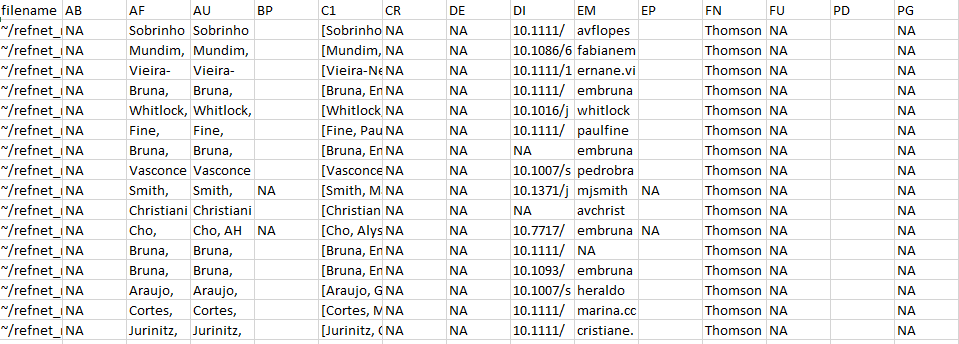
``` 

**Figure 1** A subset of the rows and columns in the .csv output from `references_read()`. 

### 2.2. Author address parsing and name disambiguation 

The next step is to identify all unique authors in the dataset and parse their affiliations for each of their articles. This requires identifying any authors whose name appears to be represented in different ways on different publications. Name disambiguation is a complex statistical and computational problem for which researchers have used data ranging from author affiliation to patterns of coauthorship and citation (reviewed in Smalheiser & Torvik 2009). The `authors_clean()` disambiguation algorithm, described in greater detail in Appendix 4, first assigns every author of every article in the dataset a unique identification number ("authorID"). It then uses the information provided about the authors of each article (e.g., email addresses, ORCID numbers) to putatively pool all names and name variants representing the same author in a group. The groups of names/name variants representing different authors are then each assigned a unique identification number (i.e., the different "authorID" numbers putatively determined to be the same author are assigned the same "groupID" number). The function `authors_clean()` has one argument:  

- **references**: The object created by `references_read()`, from which author names will be extracted. Any previously generated output from `references_read()` that has been saved to an object can be used.


The output of `authors_clean()` is a list in the R workspace with two elements: (1) "prelim", which is the initial list of disambiguated author names, and (2) "review", which is the subset of authors with putative name variants suggested for verification. Each of these elements can also be saved as separate .csv files, e.g., in the output folder in the working directory.  

Once disambiguation is complete, users can accept `refsplitr`'s results without reviewing names flagged for manual inspection (Section 2.2.1). Alternatively, users can review the subset of names recommended for inspection and make corrections if needed (Section 2.2.2). These corrections are then used to generate the 'refined' dataset used for analyses (Section 2.2.3). 

#### Example

a. To disambiguate the authors of the references in the dataset and place the "preliminary" and "review" author lists in the "output" folder: 

```{r, results="hide"}
example_a_clean <- authors_clean(example_refs)
write.csv(example_a_clean$prelim,"./output/example_a_clean_prelim.csv")
write.csv(example_a_clean$review,"./output/example_a_clean_review.csv")
```

```{r}
str(example_a_clean)

```


```{r, echo=FALSE, fig.pos="H", out.width="500px"} 
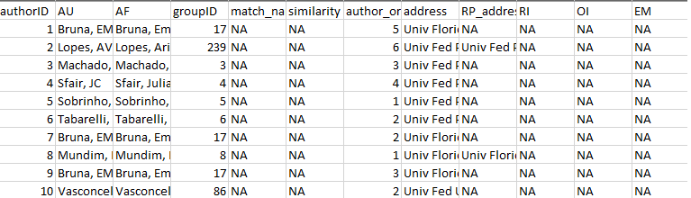 
``` 

**Figure 2** A subset of the rows and columns in the "Prelim" .csv file output from `authors_clean()`

#### 2.2.1. Accepting the results of author disambiguation *without* manual review

Accepting the result of `refsplitr`'s disambiguation algorithm without inspecting names flagged for review is done with the `authors_refine()` function. It has four arguments:  
 
- **review**: The names proposed for manual review by `authors_clean()`. Must be in an object.

- **prelim**: The preliminary file of disambiguated author names created with `authors_clean()`. Must be an object.

- **sim_score**: The threshold for the similarity score below which authors are assigned different groupIDs (range: 0-1; 1 = names must be identical to be assigned to the same group). By default this argument is turned off, and only needs to be included in cases where users want to change the default sim_score value of 0.9 to a more stringent or relaxed threshold for groupID assignment. 

- **confidence**: The threshold for the confidence score below which authors are assigned different groupIDs (range: 0-10; 0 = the name and matched name have no identifying information, and therefore we can not be very confident they are the same person. 10 = the names have similar information or are unique in some way, we were not able to match them automatically but are very confident that could be the same person.). By default this argument is turned off, and only needs to be included in cases where users want to change the default confidence score threshold of 5 to another value (see Appendix 5 for further details). 


The output of `authors_refine()` is an object in the R Workspace and a .csv file in the 'output' folder.    

#### Example

a. To accept the results of author disambiguation **without** manual review (`sim_score` and `confidence` scores = default values): 

```{r}
example_a_refined <- authors_refine(example_a_clean$review, 
                                    example_a_clean$prelim)
```

b. To accept the results of author disambiguation **without** manual review (`sim_score` and `confidence` scores = user modified): 
authors_refine(review, prelim, sim_score = NULL, confidence = NULL)

```{r}
example_a_refined <- authors_refine(example_a_clean$review, 
                                    example_a_clean$prelim, 
                                    sim_score = 0.70, 
                                    confidence = 4)
```


#### 2.2.2. Reviewing and correcting the results of disambiguation

Users that prefer to manually review the results of name disambiguation can do so by using the output from `authors_refine` and the _review.csv file; for a description of the information provided in these files to assist with verifying name assignments see Appendix 3.

There are two kinds of potential disambiguation errors. First, diffent authors could be incorrectly assigned to the same groupID number. Second, the same author could be incorrectly assigned multiple groupID. If disambiguation errors are found, they are corrected on the _review.csv file as follows:    

- **If different authors were incorrectly assigned the same groupID number:** replace the number in the **groupID** column of the incorrectly pooled author with the value from their **authorID** column. *Be sure to use the authorID value from the same row.* Save the corrected .csv file in the same location as "correctedfile.csv"  

- **If the same author was incorrectly assigned different groupID numbers:** replace the number in the **groupID** column of the incorrectly split name variants with a single **AuthorID** number. *We recommend using the lowest authorID number of the name variants being pooled*. Save the corrected .csv file in the same location as "correctedfile.csv"  

Once corrections have been made to the _review.csv file, they can then be incorporated using the ```authors_refine()``` function (see 2.2.3).


**Note:** Tests of our disambiguation algorithm indicate it is very accurate, but no method is perfect and errors are inevitable - especially as the number of author name variants increases. However, finding these rare errors becomes increasigly challegning as the number of references processed increases. This is because the number of names on the _review.csv file will increase as more authors, and hence author name variants, are identified. We strongly recommend using [code we have written to streamline the process of reviewing the output of ```authors_refine()```](https://github.com/embruna/refsplitr_simplify_authors_review). This code divides the list of names to review into more manageable subgroups; any errors identified are then corrected on the _review.csv file as described above.


#### Example

Figure 3 is an example of the the first few rows and columns of the review element of `authors_clean()`. Each row is the author of a paper, with their name as it is on the author list (AF). Each author has been assignd a unique authorID number as well assigned to a groupID; the match_name column provides the name under which the algorithm has grouped all of an author’s putative name variants when assigning the groupID number.  

```{r, echo=FALSE, fig.pos="H", out.width="500px"} 
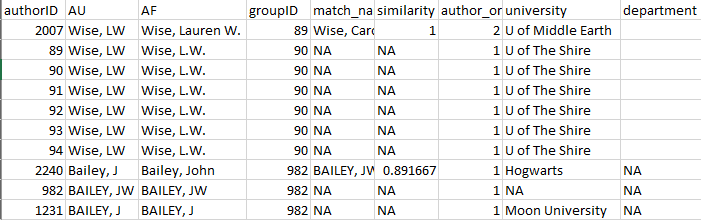 
``` 

**Figure 3:** First rows and columns from the review element of `authors_clean()`


A review of this output indicates that `refsplitr` assigned three authors sharing the last name "Bailey" and first initial "J" to groupID 982: John Bailey (authorID 2240), JW Bailey (authorID 982), and J Bailey (authorID 1231; Figure 4). However, we know that J Bailey at Moon University is a distinct individual that should not be in the same group as the other two. Their incorrect groupID number (982) should be replaced with their authorID number (1231).   

```{r, echo=FALSE, fig.pos="H", out.width="500px"} 
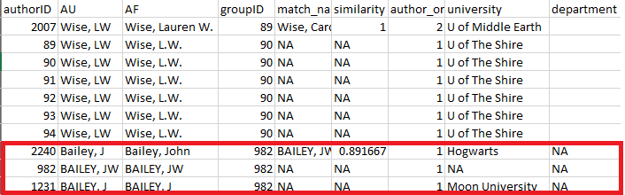
``` 

**Figure 4:** review element of `authors_clean()` highlighting three authors sharing the same last and assigned the same groupID. 


Further review reveals that there are two putative authors named LW Wise -- one at U of Middle Earth (groupID 89) and one at U of the Shire (groupID 90; Figure 5). However, an online search reveals that this is actually the same author, who recently moved from one university to the other. The groupID for all of these records should therefore be changed to "89".

```{r, echo=FALSE, fig.pos="H", out.width="500px"} 
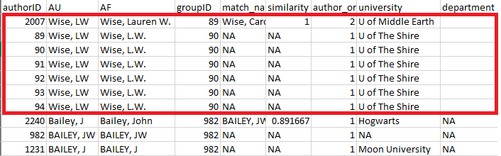 
``` 

**Figure 5:** review element of `authors_clean()` highlighting the same author incorrectly assigned to different groupID numbers. 


Once these corrections have been made (Figure 6) and saved, the changes can be incorporated using the ```authors_refine()``` function (see 2.2.3).

```{r, echo=FALSE, fig.pos="H", out.width="500px"} 
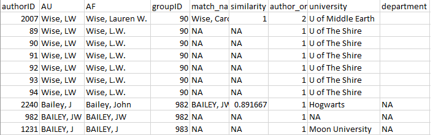 
``` 

**Figure 6:** Corrected review element of `authors_clean()`.


#### 2.2.3. Uploading and merging the results of disambiguation

Corrections made to the "review" file are merged into the "prelim" file using the `authors_refine()` function. It has four arguments:  
 
- **corrected**: The corrected version of the "review" object. Must be an object. So read in the the corrected .csv file before using this function.

- **prelim**: The preliminary list of disambiguated author names created with `authors_clean()`. Must be in an object.

- **sim_score**: The threshold for the similarity score below which authors are assigned different groupIDs (range: 0-1; 1 = names must be identical to be assigned to the same group). By default this is turned off.

- **confidence**: The threshold for the confidence score below which authors are assigned different groupIDs (range: 0-10; 0 = The name and matched name have no identifying information and therefore we can not be very confident they are the same person. 10 = The names have similar information or are unique in some way, we were not able to match them automatically but are very confident that could be the same person.)

The output of `authors_refine()` is an object in the R Workspace, which can be saved by users as a .csv file in the 'output' folder. 

#### Example

a. To load a corrected "review" file and merge the changes using the default `sim_score` and `confidence` scores: 

```{r eval=FALSE}
example_a_corrected <- read.csv("correctedfile.csv")

example_a_refined <-authors_refine(example_a_corrected, 
                                example_a_clean$prelim)
```

b. to save the results as a .csv file:


```{r, results="hide"}
write.csv(example_a_refined,"./output/example_a_refined.csv")
```


```{r, echo=FALSE, fig.pos="H", out.width="500px"}
knitr::include_graphics("images/AuthorMatch.PNG")
``` 
  
**Figure 7:** `authors_refine()` output.   
  
### 2.3. Georeferencing author institutions 

Users can georeference author's institutions (latitude & longitude) using the `authors_georef()` function. This function has has two arguments:  

- **data**: The output created by `authors_refine()`. Must be an object.

- **address_column**: A quoted character identifying the column name in which addresses are stored.

The output of `authors_georef()` is a 3 element list. The first element `addresses` contains all the records. The second element `missing_addresses` contains the records it was unable to georeference. The third element `not_missing_addresses` contains only the records with georeferenced addresses. 

- **Warning #1**: it can be difficult for this version of `refsplitr` (v1.0) to differentiate between geographically distinct installations of the same institution (e.g. Mississippi State University Main Campus in Starkville, MS vs Mississippi State University Coastal Research and Extension in Biloxi, MS (250 miles apart)). 

- **Warning #2** The `authors_georef()`function parses addresses from the Web of Science reference sheet and then attempts to calculate the latitude and longitude for them with the [http://www.datasciencetoolkit.org/](Datascience Toolkit). The time required to do so depends on the number of addresses being processed, the speed of the internet connection, and the processing power of the computer on which analyses are being conducted. 

- **Warning #3** The `authors_georef()`function requires address be data type = character. If importing the .csv outuput of `authors_refine()` to process with `authors_georef()`, be sure to include "stringsAsFactors = FALSE" in the `read.csv` command.


#### Example

```{r, results="hide"}
example_georef <-suppressMessages(
  authors_georef(data=example_a_refined, 
                                address_column = "address")
  )
```


```{r}
str(example_georef)
```


The data arguments needs to be the output object from `authors_refine()`. 

`address_column` defaults to the `address` column from the `authors_refine()` output. 


### 2.4. Data Visualization: Productivity and Collaboration 

`refsplitr` can generate five visualizations of productivity and collaboration. **World plots** indicate the locations of authors on a map of the world, while **Net plots** are visualizations of co-authorship networks. `plot_addresses_country()` uses the `rworldmap` package, `plot_addresses_points()`, `plot_net_address()`, and `plot_net_country()` use the `ggplot2` package, and `plot_net_coauthor()` uses package `igraph`. Advanced users familiar with these packages can customize the visualizations to suit their needs.  **Warning**: The time required to render these plots is highly dependent on the number of authors in the dataset and the processing power of the computer on which analyses are being carried out. 

#### 2.4.1. World Plot 1: Authors By Country.

The `plot_addresses_country()` makes a plot whose shading indicates the number of papers with an author based in a given country. There is no fractional authorship, e.g., if an author based in the USA has authored or coauthored 3 papers in the dataset, then the USA will be credited with 3 articles 

The function has one argument:  

- **data**: This is the addresses element from the `authors_georef()` object
 
The output of `plot_addresses_country()` is plot from the `rworldmap` package. 

#### Example

```{r, echo=FALSE, fig.pos="H", out.width="500px"}
plot_addresses_country <- plot_addresses_country(example_georef$addresses)
plot_addresses_country
```

**Figure 8:** Plot of the countries in which the authors in the dataset are based, with shading to indicate the number of authors in each of country. 

#### 2.4.2. World Plots (points)

The `plot_addresses_points()` function plots the location of all authors in the dataset. 

The function has one argument:  

- **data**: This is the output from `authors_georef()`. Must be an object.

The output of `authors_georef()` is a ggplot object. 

#### Example

```{r, fig.pos="H", out.width="500px"}
plot_addresses_points <- plot_addresses_points(example_georef$addresses)
plot_addresses_points
```


```{r, echo=FALSE, fig.pos="H", out.width="500px"}
#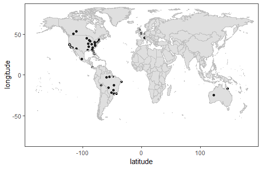
``` 

**Figure 9:** Figure indicating the georefeenced locations of authors in the dataset 

#### 2.4.3. Net Plots (base)
The `plot_net_coauthor()` function plots a co-authorship network based on the countries in which authors are based. 

The function has one argument:  

- **data**: This is the addresses element of the `authors_georef()` object.

This function has one output, a plot, built in `igraph`.

#### Example

```{r, echo=FALSE, fig.pos='H', out.width='500px'}
plot_net_coauthor <- plot_net_coauthor(example_georef$addresses)
plot_net_coauthor
```

**Figure 10:** Plot of the coauthorship network for authors of articles in the dataset. 

#### 2.4.4. Net Plots (Country)
The `plot_net_country()` function plots a coauthorship network of the countries in which co-authors are based that is overlayed on a world map. The circles represent the number of authors based in a country. 

The function has one argument:  

- **data**: This is the addresses element from the `authors_georef()` object.  

The output of `plot_net_country()` is a list in the R Workspace. The `$plot` element contains ggplot object. Because the ability to customize `$plot` is limited, three datasets are provided so that users can generate and customize their own plots:

1. The `$data_path` element contains the data for the connecting lines.

2. The `$data_polygon` element contains the data for the country outlines.  

3. The `$data_point` element contains the data for the circles on the map. 

#### Example

```{r fig.pos="H", out.width="500px"}
plot_net_country <- plot_net_country(example_georef$addresses)
plot_net_country$plot
```

**Figure 11:** Network showing how the different countries are connected. 

#### 2.4.5. Net Plots (Addresses)
The `plot_net_address()` function is used to plot a georeferenced coauthorship network based on author institutional addresses. **Warning:** This function can create a large data set (100s of MB) and may takes several minutes to complete...be patient and take into account the system resources available when running it.  

The function has two arguments:  

- **data**: This is the addresses element from the `authors_georef()` output. 
- **lineAlpha**: This controls the transparency of the lines connecting coauthors (range: 0-1, with lower values increasing the transparency).

The output of `plot_net_address()` is a list in the R Workspace. The `$plot` element contains ggplot object. Because the ability to customize `$plot` is limited, three datasets are provided so that users can generate and customize their own plots:

1. The `$data_path` element contains the data for the connecting lines. 
2. The `$data_polygon` element contains the data for the country outlines.
3. The `$data_point` element contains the data for the circles on the map. 

#### Example
```{r, fig.pos="H", out.width="500px"}
plot_net_address <- plot_net_address(example_georef$addresses, lineAlpha=0.1)
plot_net_address$plot
```

**Figure 12:** Plot showing the network between individual author locations.

## Acknowledgments

Support for the development of `refsplitr` was provided by grants to E. M. Bruna from the [Center for Latin American Studies](http://www.latam.ufl.edu/) and [Informatics Institute](https://informatics.institute.ufl.edu/) at the [University of Florida](http://www.ufl.edu/).

## References

Aria, M. & Cuccurullo, C. (2017) bibliometrix: An R-tool for comprehensive science mapping analysis. Journal of Informetrics, 11(4): 959-975. DOI: 10.1016/j.joi.2017.08.007 

Fortunato, S., C. T. Bergstrom, K. Barner, J. A. Evans, D. Helbing, S. Milojevic, A. M. Petersen, F. Radicchi, R. Sinatra, B. Uzzi, A. Vespignani, L. Waltman, D. Wang, & A.-L. Barabasi (2018). Science of science. Science, 359: eaao0185. DOI: 10.1126/science.aao0185 

Larivière, V., Ni, C., Gingras, Y., Cronin, B., & Sugimoto, C. R. (2013). Bibliometrics: Global gender disparities in science. Nature News, 504(7479): 211-213. DOI: 10.1038/504211a

R Core Team (2019). R: A Language and Environment for Statistical Computing. R Foundation for Statistical Computing, Vienna, Austria. URL https://www.R-project.org/.

Smalheiser, N. R., & Torvik, V. I. (2009). Author name disambiguation. Annual Review of Information Science and Technology, 43(1): 1-43. DOI: 10.1002/aris.2009.1440430113

Smith, M. J., Weinberger, C., Bruna, E. M., & Allesina, S. (2014). The scientific impact of nations: Journal placement and citation performance, PLOS One 9(10): e109195. DOI: 10.1371/journal.pone.0109195

Strotmann, A. and Zhao, D., (2012). Author name disambiguation: What difference does it make in author based citation analysis?. Journal of the Association for Information Science and Technology, 63(9): 1820-1833. DOI: 10.1002/asi.22695

Sugimoto CR, Larivière V. (2018). Measuring Research: What Everyone Needs to Know?. Oxford University Press, Oxford, UK. 149 pp. ISBN-10: 9780190640125 

Westgate, M. J. (2018). revtools: bibliographic data visualization for evidence synthesis in R. bioRxiv:262881. DOI: 10.1101/262881


## **Appendix 1:** Guide to downloading reference records from the Web of Science.

```{r, echo=FALSE, fig.pos="H", out.width="250px"}
# 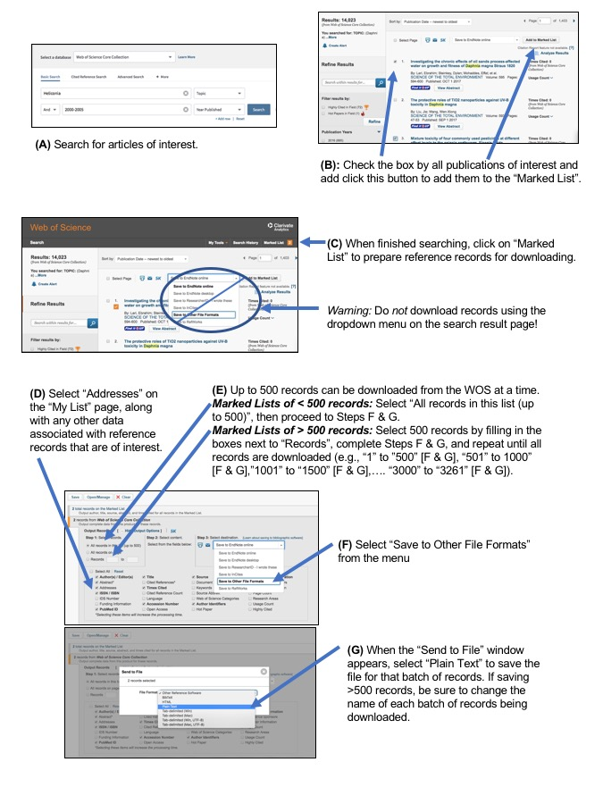

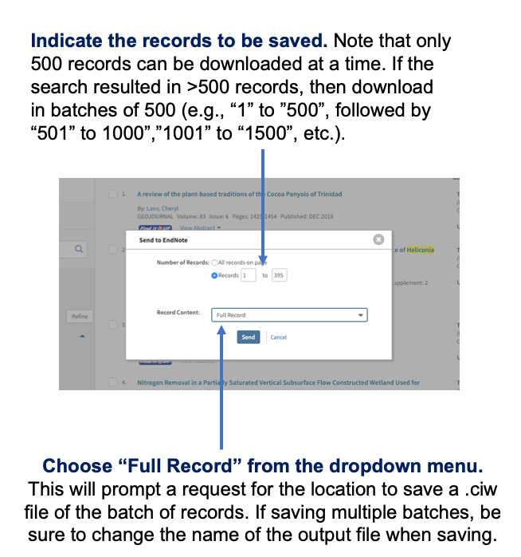
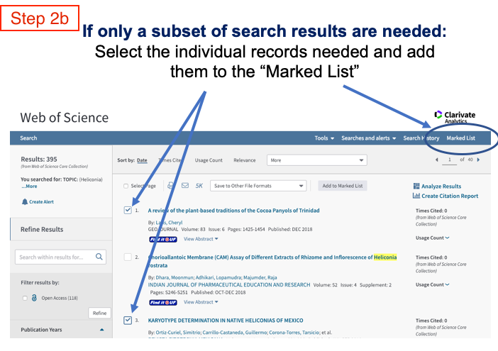
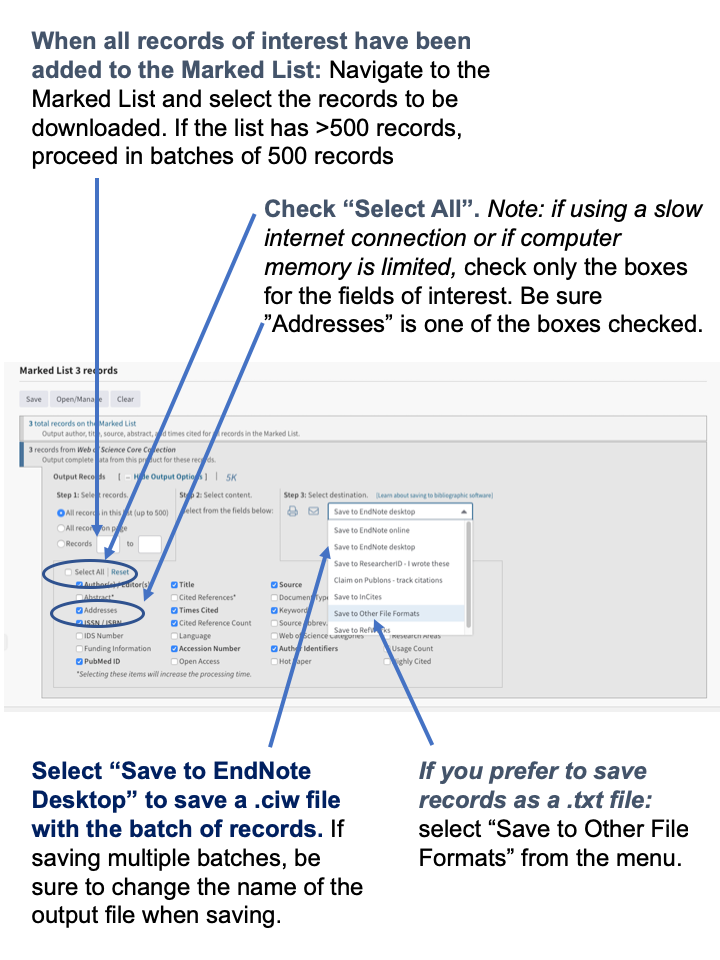

```

**Figure 13:** Web of Science Download Instructions

## **Appendix 2:** Web of Science Data Field Definitions

```{r echo = FALSE, results = 'asis'}
App2Table1<-read.csv("App2_Table1.csv",dec=".", header = TRUE, sep = ",", check.names=FALSE)
knitr::kable(App2Table1, caption = "Definition of column headings in the output of read_references()^1^. Most are [Web of Science Core Collection Field Tags](https://images.webofknowledge.com/images/help/WOS/hs_advanced_fieldtags.html) associated with different data types.")

```


^1^the following Web of Science data fields are only included if users select the `include_all=TRUE` option in `references_read()`: CC, CH, CL, CT, CY, DT, FX, GA, GE, ID, IS, J9, JI, LA, LT, MC, MI, NR, PA, PI, PN, PS, RID, SU, TA, VR.

^2^Includes citations in the Web of Science Core Collection, BIOSIS Citation Index, Chinese Science Citation Database, Data Citation Index, Russian Science Citation Index, and SciELO Citation Index.

## **Appendix 3:** Reviewing and correcting author name assignments by `authors_clean()`


```{r echo = FALSE, results = 'asis'}
App3Table1<-read.csv("App3_Table1.csv",dec=".", header = TRUE, sep = ",", check.names=FALSE)


knitr::kable(App3Table1, caption = "Information provided by the `authors_clean()` function to help users assess the validity of groupID assignments made by `refsplitr`'s disambiguation algorithm.") 
```


## **Appendix 4:** Overview of the `refsplitr` author name disambiguation algorithm.

Name disambiguation is a complex process that is the subject of active research. There are a variety of approaches to disambiguation in large datasets; here we describe the algorithm for parsing author addresses and disambiguating author names with the `authors_clean()` function. 

There are three primary difficulties in assigning authors to their products in bibliometric databases like the Web of Science. First, not all authors have a unique identifier such as an [ORCID iD (ORCID)](https://orcid.org/) or [ResearcherID (RID)](http://www.researcherid.com/Home.action?returnCode=ROUTER.Success&Init=Yes&SrcApp=CR&SID=6CmSYQQpa1DmjP5Mo3H). Second, an author's name can vary over time. It can also be reported inconsistently accross journals. For instance, while author last names are always reported, the first names might only be represented by initials and middle names (if authors have one) might not be reported or might only be stored as a middle initial. Finally, information in the "address" field can have inconsistent structures. In addition, [only after 2008 did Web of Sceince records directly link each author with their institutional address](https://images.webofknowledge.com/images/help/WOS/hp_full_record.html#dsy1030-TRS_addresses). As a result, for pre-2008 Web of Science records it can be difficult to relate each author with their institutional address (the same is true for emaail addresses). In these cases, we have no way to reliably match addresses to authors using the information in the reference record and therefore insert 'Could not be extracted' in the address field. This does not mean an address was not listed or cannot be assigned after manual inspection - only that there was no way to discern to which author the address belongs. Coupled with changes in author addresses as they change institutions, this the inconsistent or incomplete information associated with author addresses makes disambiguating names difficult. 

To address this we've created a process to identify clusters or common authors by iteratively building webs of authors using any available information to link groups together. In this way we do not require an entry to contain all relevant fields, but can nevertheless create likely groupings and then refine them by throwing out obvious spurious connections. In the case of authors with ORCID and RID numbers, identifying commonalities is quite easy, and we hope that authors will continue to sign up for these identifiers to facilitate disambiguation. 

The first step in our disambiguation process is matching all groups together with common ORCID and RID numbers. The remaining entries go through a series of logical rules to help match the author with only *likely* entries. Throughout this analysis we assume that every author has a complete last name and require the author's record contain any two of the following: first name, middle name, address, or email (the first and middle name can be initials). Requiring this type of information means we cannot match authors that do not contain any of this extra information, and so we do not group entries with no middle name, address, AND email, but instead call them their own group and skip them from the following analysis. To lower calculation times, as the algorithm attempts to match each entry it creates a subset of possible matching combinations of last and first names, and then attempts to match them against middle initials, address, and email addresses.

- *note regarding email addresses* - Similar to street addresses, email addresses are often stored inconsistently with no direct link between a specific author and specific email address. In these cases, we run a Jaro-Winkler distance measurement that calculates the amount of transpositions required to turn one string (an author name) into another (an email address). This works very well when email addresses are in a standard format (e.g., "lastname"."firstname" @ university.edu). We match author names to each email and use a threshold percentage of 0.70. If no names match up below this threshold we disregard the email and leave the field blank in the author name.


Below is an example of how the algorithm processes a sample data set.
 
```{r, echo=FALSE, fig.pos="H", out.width="500px"}
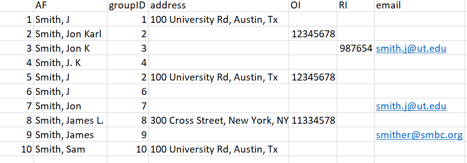

``` 
 
**Figure 14:** Example dataset. 
 
In this dataset we have 10 authors, with a mixture of incomplete columns for each row. Rows 2 and 5 were given the same groupID priori because of their matching ORCID. We'll walk through the remaining entries and how the algorithm matches names together.

To lower the number of Type II errors we build a dataset of possible matches for each author; each entry in this subset must adhere to the following guidelines:

1.	In all cases last names must match exactly (case insensitive). This means misspelled names will likely not get matched *unless* they have an ORCID or RID against which to match.

2.	First names must match; in the case they only have an initial then that initial must match.

3.	Middle names must match; in the case they only have an initial they must match. Cases of authors with no middle name are allowed if the author's record has another piece of identifying information (e.g., an address or email address).

**Entry 1.** In our test data we will start trying to match the first entry "Smith, J" in row 1. By subsetting with the above rules, we'd be matching the first row against rows 2, 3, 4, 5, 6, 7, 9:

```{r, echo=FALSE, fig.pos="H", out.width="500px"}
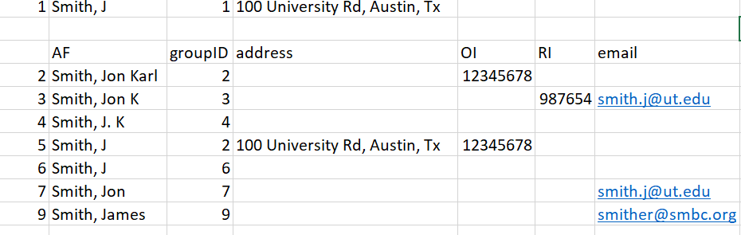
``` 

**Figure 15:** Figure for entry 1 

Once we have our subset of possible similar entries, we match the existing info of row 1 against the subset. The entry only needs to match one extra piece of information - either address, email, or middle name. If it matches we assume it is the same person, and change the groupID numbers to reflect this. 

In our test data, there is only one piece of information we can match against - address, which makes the obvious match Row 5. We therefore change the groupID for our entry to groupID = 2. This gives us three entries with groupID = 2.

**Entry 2.**  Row 2 was already matched to another group using ORCID prior, so it is skipped.

**Entry 3.** Row 3 has 2 unique identifying pieces of information: A middle initial and an email. This subset is smaller because we have a middle initial to filter out the Smith, J.L entries: 
 
```{r, echo=FALSE, fig.pos="H", out.width="500px"}
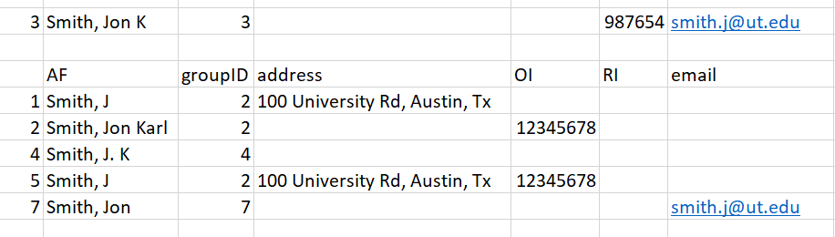
```  
 
**Figure 16:** Figure for entry 3
 
Matching this information against our subset, the two possible matches are Row 2 and Row 7. In cases with multiple matches we choose the entry with the lowest number, as it is likely to have been grouped already. However, even if the entry in Row 7 was chosen as a match, it  will eventually be matched up to groupID = 2. When a 'parent' groupID is changed in this way, all the 'child' entries are changed to match the new groupID as well. As such, the decision is partially arbitrary.

**Entry 4** - This entry gets assigned groupID = 2 as well because it has a matching middle initial with Row 2 and Row 3:

```{r, echo=FALSE, fig.pos="H", out.width="500px"}
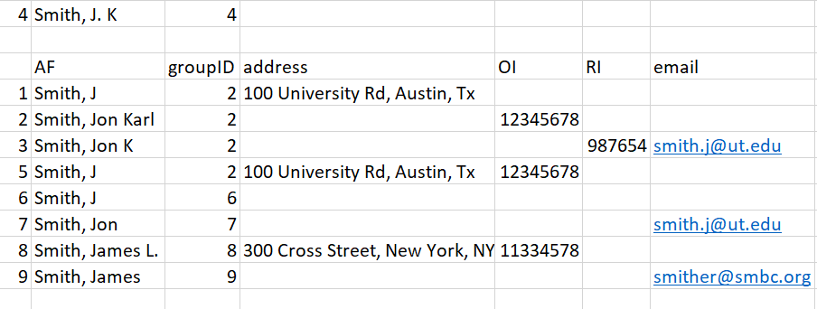
``` 

**Figure 16:** Figure for entry 4

**Entry 5** - Row 5 has already been matched with ORCID, so it is skipped.

**Entry 6** - Row 6 has no additional matching information - no middle name, address, or email. There is therefore no way to reliably know which 'Smith, J` it belongs to, so the entry is assumed to be its own unique group and is skipped.

**Entry 7** - Entry 7 has one unique identifier: an email address. It gets matched to the entry in Row 3 and therefore is assigned groupID = 2. 

```{r, echo=FALSE, fig.pos="H", out.width="500px"}
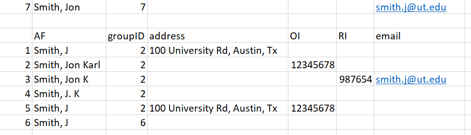
```  

**Figure 17:** Figure for entry 7

After these first 7 entries, we've correctly matched all likely 'Smith, Jon Karl' together and created the 'Jon Karl Smith' complex. Now we'll move onto a situation where we have inadequate information, and must therefore run a Jaro-Winkler distance analysis to decide the likely match.

**Entry 8** - This novel entry has two unique pieces of information: a middle initial and an ORCID. We know the ORCID did not match any previous entries, and the middle initial does not match up with any of the 'Smith' names in our record. 
 
```{r, echo=FALSE, fig.pos="H", out.width="500px"}
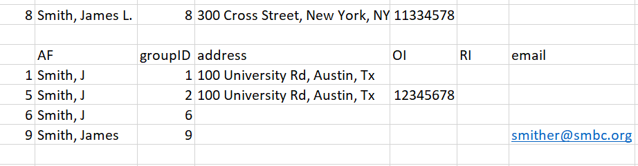
```  

**Figure 18:** Figure for entry 8

Because there are no suitable matches using initial criteria, we instead match the entry by calculating a Jaro-Winkler distance between the name in Row 8 and the author names in our subset. The results are: 0.9 [Row 1], 0.9 [Row 5], 0.9 [Row 6], and 0.96 [Row 9]. Therefore, the most likely match for the name 'Smith, James L' is the name in Row 9 ('Smith, James'). We change the  groupID to 9, and set aside this entry for the user to manually review later. 

**Entry 9** - Results in the same result as 8 and is matched to entry 8 which already has the groupID of 9. 

**Entry 10** - This entry has no matching names and results in no change to the groupID number.

```{r, echo=FALSE, fig.pos="H", out.width="500px"}
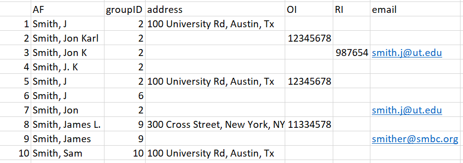
``` 

**Figure 19:** Figure for Entry 10

Thus our final results are: 
 
```{r, echo=FALSE, fig.pos="H", out.width="500px"}
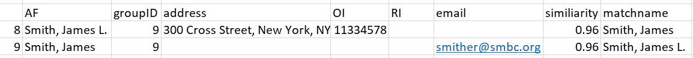
```  
 
**Figure 20:** Final Results. 

As a final check against our created groupings, we attempt to prune groupings by reanalyzing if First name, last name, and middle names match. This is because matching entries using incomplete info occasionally creates novel situations where two similar names are called the same groupID if they have similar other information like same first name and the same address. Additionally, the imperfect matching of email addresses occasionally matches up relatives or significant others who publish together with the incorrect email creating a mismatched complex. This final pruning step separates the groups entirely by name. It should be noted this situation in general is rare. 

This step is not necessary in our example data as all names in each grouping were logical. In our final data set, we have therefore identified 4 likely complexes (Smith, Jon Karl; Smith, J; Smith, James; and Smith Sam). Entries 8 and 9 were matched together and require hand checking as no novel information was used. This results in this data.frame being outputted separate from the master authors data.frame:


## **Appendix 5:** Overview of the `refsplitr` confidence score calculation.

To help the user identify potential false positives and negatives of author matches, we calculate a confidence score metric. This metric is calculated on names who could not be matched automatically by our algorithm above, but were matched using a 'best guess' approach using the available information and the Jaro Winkler textual matching. Names matched using this method suffer from higher false positive rates because we lacked proper information to match them directly. This metric is a 0 - 10 rating where 0 means we have no information that would lead us to be confident on the match, and 10 meaning based on the available information we are very confident the name is correct (but not enough to have matched automatically). Names are given a score using the following criteria:  

4 - The postal code matches  
2 - The country matches  
2 - The last name is longer than 10 characters  
2 - The last name contains a dash (like when there are two surnames)  
1 - The last name is longer than 6 characters but less than 11.  
1 - Either name has a middle initial  
1 - Either name has a full first name  
1 - For each instance a name or match name contains a university or email (And thus easier to find a match using Google).  

The maximum score is 10 regardless of the total scores sum.  

Using this score criteria we find that >7 are very likely always correct, scores >=5 but <7 are nearly always correct, and <5 are variable in their accuracy.

This can help guide the user when manually checking reviewed names, but can also speed up the process when running analysis. Users can set their confidence threshold in `authors_refine` depending on their tolerance for false positives in their analysis without needing to manually check all reviewed names.
